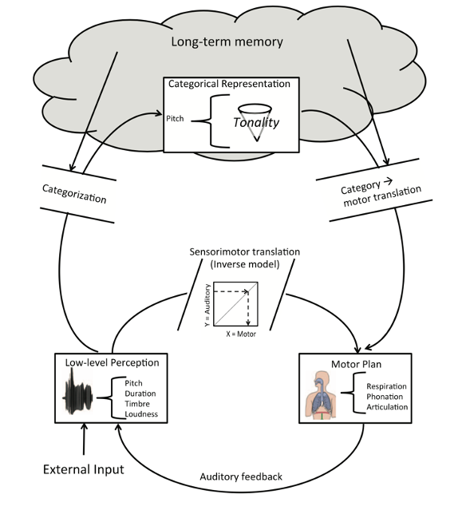

# Playing By Ear: A Theoretical Model {#theoretical-model}

As far as the author is aware, no computational model of playing by ear has been described in the music psychology, or related, literature(s). Thus, a first step in this thesis is to propose a theoretical model, which can then later be formulated more precisely as a computational model, then tested, partly with data collected throughout this thesis. 

However, related computational models have been described, for instance in the domain of aural skill acquisition [@bakerModelingMelodicDictation2019] and sung melodic recall by the author [@silasLearningRecallingMelodies2023; @silasSingingAbilityAssessment2023]. Theoretical cognitive models have also been described in the domain of singing accuracy [@pfordresherTheoreticalPerspectivesSinging2015]. Therefore, in this section, I will attempt to synthesise this literature to propose a corresponding model specifically for playing by ear skills. I distinguish between two basic playing by ear processes: a) playing by ear skill acquisition (learning) and b) playing by ear skill execution (recall).

## Pfordresher's H-PAC Model

## Pfordresher's Cognitive Model of Singing Accuracy

I start first by using @pfordresherTheoreticalPerspectivesSinging2015's cognitive (but non-computational) model of singing accuracy, which is the most broad of the models I will review. At the low level, this model comprises an auditory feedback loop. In this loop, first, external auditory input is processed as low-level perceptual representations of sound (pitch, duration, timbre, loudness). Such low-level representations are used as input to a translation model, which relates auditory input to sensorimotor action that is relevant to singing. Hence, this enables the guidance of a singer’s sensorimotor plans to adjust their singing (e.g., to be in tune), in response to auditory feedback. Such changes in sensorimotor actions comprise physical processes like respiration, phonation, and articulation. Abstracting the sensorimotor part to the domain of playing by ear, such physical processes would be somewhat instrument-specific. For many instruments, the physical part will involve finger coordination (e.g., clarinet, violin), but for some, coordination will be more at the level of the arm  (e.g., percussion, drums). Many processes will be instrument-specific processes. For example, for brass and woodwind instruments, requiring to coordinate an embouchure to produce a sound. We do not exhaust these instrument-specific processes, but only state that such physical processes are part of the model, with instrument-specific attributes.

The lower-level auditory representations are also used as input to higher levels of cognition, which hold mental templates about music (e.g., its features, such as its tonality), stored in long- term memory (Baddeley et al., 2009). These templates allow auditory content to be categorized, forming more sophisticated representations of it, taking on musical domains such as representations of (melodic) features like tonality and contour, as well as segmenting melodies into coherent perceptual chunks. These formed higher-level representations can in turn be used as input back to the lower-level auditory feedback loop and further inform sensorimotor planning. Hence, the overall architecture of Pfordresher et al. (2015)’s cognitive model is bidirectional: both "top down" and "bottom up". Altogether, this system enables a singer - to fulfill objectives related to sung recall (i.e., hearing stimuli, representing its musical features mentally, responding through singing, and adjusting behavior to fulfill the goal sufficiently). This can readily be abstracted to playing by ear too: the only difference being in the motor plan aspects, which, as mentioned, are instrument-specific. Our focus in the current manuscript is on the higher-level aspects of this model: memory for melodic representations. 

## Baker's Computational Model of Melodic Dictation

## Models of Sung Recall

Lastly, I synthesise models from my own research regarding sung melodic recall. My @silasSingingAbilityAssessment2023 study investigated sung recall by examining its relationship with other related skills and participant attributes. Demographically, better sung recall ability ability was associated with more musical training (𝛽 = 0.07), a younger age (𝛽 = -0.05), and being female (𝛽 = -0.03), though the latter two effects were small. The findings suggest that while musical training can enhance singing ability, inherent skills might also predispose individuals to seek musical training. Moreover, there was a relatively large difference between the marginal and conditional R^2 values, which suggests that there is a sizeable proportion of individual differences in the sample of participants tested which explains SAA performance which shows that individual differences should explain performance on a task in which one can develop high levels of domain-specific expertise.

We found there that melodic discrimination, pitch imagery abilities, and mistuning perception appear to be fundamental skills contributing to melodic sung recall. The sung recall score we devised moderately correlated with self-reported singing ability (r = .46) and musical training (r = ?). However, it shows no significant correlation with visuospatial working memory or pitch discrimination, aligning with previous research and suggesting that singing ability is not closely linked to low-level perceptual processes. This suggests that, whilst 

The study also shows that melodic features which indicate melodic complexity (including melody length) are relevant predictors of sung recall performance. These predictors represented melody length, as well as features related to contour, tonality, statistical occurrence of N-grams in the melody, and durational complexity. Rhythmic trials were generally found to be more difficult (B = -0.15, p < .001) and we found that it was appropriate to create separate models for arhythmic and rhythmic.

In another of my papers, [@silasLearningRecallingMelodies2023], we investigated how individuals learn and recall melodies using a computational approach that emphasizes similarity metrics rather than traditional accuracy-based methods. The research involved 31 participants who sang back 28 melodies presented either as piano sounds or vocal audio excerpts from pop songs, with each melody repeated up to six times. The similarity between the target melody and the participants' sung recalls was measured using advanced algorithmic techniques. The primary goal was to understand how melodic recall improves over successive attempts and what factors most significantly influence recall accuracy.

One of the key findings of the study is that the length of sung recall attempts consistently increases across multiple attempts, and this increase significantly correlates with the overall similarity to the target melody. This observation challenges the traditional view that musical features such as interval patterns or tonality are the primary factors influencing melodic recall. Instead, the study suggests that the sheer length of the melody plays a more critical role, indicating that general memory constraints may be more influential than music-specific features. This insight aligns with theories of working memory, suggesting that melodic recall shares characteristics with other types of serial recall rather than being purely domain-specific to music.

A significant finding (presented there in Figure 8), examines how similarity changes as a function of attempt and the specific section of the melody (beginning, middle, end). The results show that similarity performance increases more rapidly for the beginning of the melody compared to the middle and end across successive attempts. This indicates that participants tend to stabilise their recall of the initial melodic segments earlier than the middle or end sections. The end sections, in particular, show a slower rate of improvement, suggesting that the latter parts of a melody are more challenging to accurately recall perhaps due to the higher working memory load as a result of having to remember more notes, the later you are in a position, or that generally people engaging in sung recall prioritise getting the earlier parts melody correct first.  This finding supports the theory that memory encoding is stronger for the beginning of sequences, a phenomenon consistent with the primacy effect observed in other types of serial recall tasks. It also highlights that recall accuracy is not uniformly distributed across a melody, with the initial segments being more robustly learned compared to later ones.

The study also found that musical training did not significantly enhance recall performance when similarity metrics were used as the primary assessment method, as shown in another key result. This challenges the conventional belief that formal musical training substantially improves melodic recall ability. Instead, the data suggests that domain-general memory skills may be just as important, pointing to a more integrative understanding of how musical and non-musical cognitive processes interact.

Moreover, the results highlight that similarity scores increase with each successive attempt, but the rate of improvement diminishes after the third or fourth attempt. This pattern suggests that the most substantial gains in melodic recall occur early in the learning process, followed by incremental refinements in pitch and rhythm accuracy. Additionally, melodies presented as vocal audio excerpts resulted in higher recall accuracy compared to piano sound presentations, indicating that the human voice might provide additional mnemonic cues that aid in memory encoding.

Overall, the study's use of similarity-based metrics, particularly the "opti3" metric that integrates pitch intervals, harmonic progression, and rhythmic similarity, offers a more nuanced and accurate assessment of how melodies are learned and recalled. By focusing on the gradual increase in recall length and the differential improvement across melodic segments, the study sheds light on the underlying cognitive processes involved in melodic memory, emphasizing the role of general memory mechanisms and the relatively limited impact of formal musical training.

## Bringing It Together

In sum, then, 

## Moving from Theoretical to Computational 

"When we develop a psychological theory that is sufficiently precise to be implemented as a computer program, we call it a computational model. The process of developing such theories, and implementing their corresponding computer programs, is then called computational modelling." [@harrisonMusicScience2025].

At this point, I already suggest a more specific feature to the model: that for playing by ear tasks, there exists a mental melodic "similarity" algorithm, housed in working memory. The input to this module is the target melody and the evolving real-time assessment of the melody being produced in the moment. The performer must hear the target melody, store this in short term memory as a reference, and then continuously update the target melody which each new note that is produced. I speculate that the mind recomputes the similarity between the presently number of recalled notes and the target melody iteratively, each time a new note is added. In other words, a check for the accuracy is made every time a note is recalled, and the presence of an error and its nature, will inform whether or not the performer stops to start again or continues to proceed recalling the melody, at least in the stage of learning. Formally:

### Inputs
- \( T = [t_1, t_2, \dots, t_n] \): TargetMelody of fixed length \( n \).
- \( R = [r_1, r_2, \dots, r_k] \): RecalledMelody of length \( k \), unknown a priori.

### Sequential Construction
- \( T \) is fixed and built one note at a time.
- \( R \) is sequentially constructed one note at a time.

### Function Application
- At each step \( i \) (current length of \( R \)), the function **MelSim** is applied to **TargetMelody** and the current length of **RecalledMelody**.

## Mathematical Representation

Let:
- \( T_i \) be the prefix of the TargetMelody up to length \( i \), i.e., \( T_i = [t_1, t_2, \dots, t_i] \).
- \( R_i \) be the current state of the RecalledMelody of length \( i \), i.e., \( R_i = [r_1, r_2, \dots, r_i] \).
- \( \text{MelSim}(T_i, R_i) \) be the similarity function between the two melodies at length \( i \).

The MelSim function can be formulated as:

\[
\text{MelSim}(T_i, R_i) = f(T_i, R_i)
\]

Where:
- \( f \) is a similarity measure (e.g., distance function, alignment score).
- \( i \) iterates from 1 to \( n \), where \( n \) is the fixed length of the target melody.

## Algorithm Flow

1. Start with an empty recalled melody \( R \).
2. For each new note \( r_i \) added to \( R \):
   - Compute the similarity: \( \text{MelSim}(T_i, R_i) \) if \( i = n \).
3. Repeat until the entire recalled melody is constructed.

## Final Equation

The similarity calculation is performed only when the length of the **RecalledMelody** equals the fixed length of the **TargetMelody**. Therefore, the final equation is expressed as:

\[
\text{MelSim}(T, R_n) = f(T, R_n)
\]

I note that the `MelSim` algorithm is itself modular and of discussion in and of itself (cite M&F). For the purpose of this paper,

## Strategies

- Beyond scope of this dissertation to investigate in detail.
- Pop strategies hypotheses: [@liscioWatchingPopularMusicians2024]
- Also, we have our own text data, for later.

## The Melodic Mind as Item Bank

- Big concept

## Predictions

- Simpler melodies will rely more on general working memory than musical working memory.
- In the short term (< 30 mins), melodies learned by sight will be less better retained than those 

