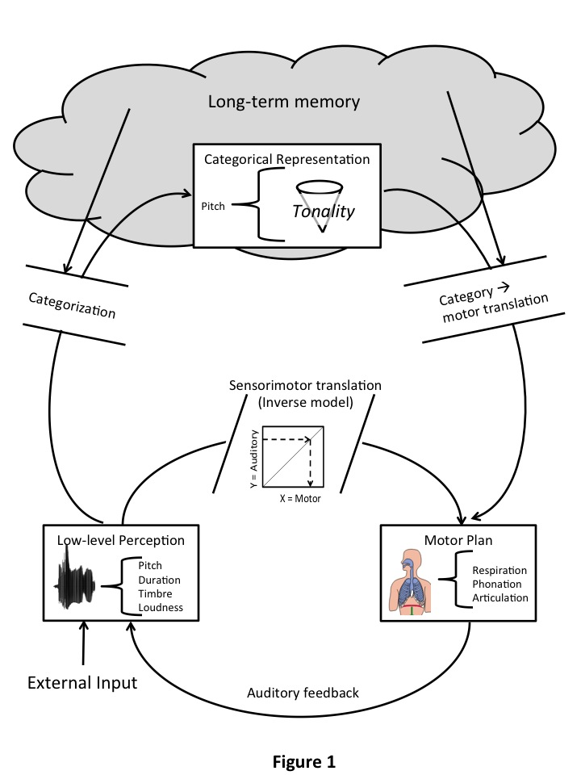
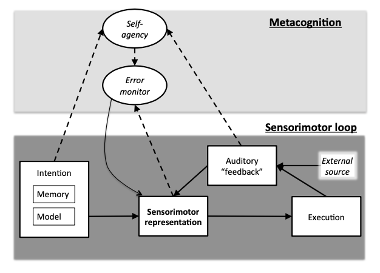

# Backgrounds {#backgrounds}


TODO: Webster and Greg Surber dissertations should appear here!


## Historical Background: Approaches to Improving Playing by Ear in Jazz Music {#historical_background}


Jazz music began as an oral tradition where skills were developed through listening and imitation rather than formal instruction. The development of aural skills to support improvisation (i.e., playing by ear") — has been a central feature of learning jazz music throughout the 20th and 21st centuries. In this section, I describe the historical evolution of approaches to developing aural skills in jazz music. I survey how record players, transcription books, and pattern books have supported the ear training process in jazz music and the evolving interplay between informal, aural traditions and formalised, institutional methods. This suggests a gradual shift from purely aural learning to increasingly systematised approaches, reflecting broader trends in the institutionalisation of jazz education. Despite this evolution, the fundamental importance of developing acute listening skills remains central to effective jazz pedagogy and discourse.

### The Aural Origins of Jazz Education

The early history of jazz was characterised by learning that occurred primarily through aural means involving "hours of listening, transcribing, and participating in jam sessions" [@herzig2019abc] before formal educational approaches emerged. In this pre-institutional era, the transmission of jazz knowledge occurred organically within communities of practice, with experienced musicians serving as mentors to aspiring players. This master-apprentice relationship formed the foundation of early jazz pedagogy, where direct demonstration and immediate repetition were the primary teaching methods. The absence of formal jazz education in the early period necessitated the aural approach, as musicians needed to develop their skills through direct engagement with the music itself. While some things were written down, such as Downbeat magasine transcriptions in the 1940's [@kogerFiftyYearsBeat1985], the vast majority of what people learned and played was done solely "by ear". This established a precedent that would continue to influence jazz pedagogy, even as more formalised approaches developed. The emphasis on learning by ear ensured that early jazz musicians developed strong aural skills as a natural consequence of their training process.

### Record Players as Pedagogical Tools

The development of recording technology dramatically transformed jazz education by making the music of master performers accessible to aspiring musicians regardless of geographic location. Recordings became essential educational resources, allowing students to study the repertoire and improvisations of established artists [@butterfield2002music; @re2004role]. This technological advancement democratised access to jazz education, extending learning opportunities beyond those who could physically attend performances or study with established musicians. Technologies such as variable-speed turntables and digital audio software enabled closer analysis, allowing students to slow down recordings for detailed ear training [@re2004role]. Listening became active engagement, with learners looping short segments, replicating phrases, and attempting to match phrasing and articulation. The ability to repeatedly listen to recorded performances proved particularly valuable, especially since records could be "endlessly repeated" [@surberRecordProgressionsTechnology2009]. This repetition allowed students to internalise not only melodies and chord progressions but also nuances of style, tone, and expression that are difficult to communicate through written notation. The practice of slowing down recordings or lifting the needle to replay difficult passages became standard pedagogical techniques that allowed for deep analysis of complex musical passages. @berliner1994thinking emphasises that imitation from recordings helped players build a mental library of harmonic and melodic ideas, forming a foundation for improvisation.

The phonograph (and later recording techologies e.g., CDs, MP3s etc.) thus become an indispensable tool for jazz learners. Listening to records enabled musicians to internalise jazz language and style. Even as jazz moved into universities, listening retained primacy. As @wilf2012rituals describes, jazz education features "rituals" that centre around repeated listening to and playing along with canonical recordings. These practices continue to uphold the oral traditions at the heart of jazz pedagogy.


### Codification of Jazz Education


The transition from purely aural learning to more systematised approaches began in the mid-20th century. @herzig2019abc identifies the 1930s as a pivotal period, with early attempts to codify jazz instruction including @beihoffCourseModernArranging1934's "Modern Arranging and Orchestration" and Lee Bowden's training program for Afro-American Service Musicians at the Great Lakes Naval Base (1942-45). These initial efforts to systematise jazz education represented the beginning of a shift toward more formalised and codified instructional approaches, though they remained relatively limited in scope. However, the rise of printed transcription books - like the *Charlie Parker Omnibook* in the 1970's [@parkerCharlieParkerOmnibook2009] - introduced shifts in practice. While these books provided accessible models for study, @witmer1988historical argued that many early transcription collections failed to support active listening, with students relying more on notation rather than using their ears. Generally, transcription is thought most effective when used in tandem with active listening: students should first attempt to transcribe by ear and then use notated versions for verification or analysis [@berliner1994thinking; @re2004role]


### The Chord-Scale Approach, Pattern Books, and Melodic Vocabulary Acquisition

A watershed moment in jazz education came in the late 1960s, with what @herzig2019abc terms "the ABCs of jazz" - referring to the influential work of Jamey Aebersold, David Baker, and Jerry Coker. Their development of comprehensive instructional materials, including @bakerJazzImprovisationComprehensive1969's "Jazz Improvisation: a Comprehensive Method for all Players" and Aebersold's play-along recordings, established a framework for jazz education that continues to influence pedagogical approaches today. These materials helped standardise jazz instruction and made it more accessible to students without direct access to master performers, contributing to what @proutyHistoryJazzEducation2005 describes pejoratively as the "wholesale growth" of jazz education during the 1960s and 70s.


The chord-scale approach pioneered by Baker, Aebersold, and Coker became a dominant paradigm in jazz education. These influential educators "focus on scales and modes to examine improvisation" [@spiceLiteratureReviewJazz2010]. This approach provided students with systematic frameworks for navigating harmonic structures, offering concrete tools for developing improvisational facility. The emphasis on scales and patterns created a more accessible entry point for students transitioning from classical training to jazz improvisation.

Aebersold's own description of his pedagogical evolution reveals the gradual systematisation of his approach: "I published my first jazz play-a-long in 1967 and the [accompanying] booklet included concert [key] chords for each track. Subsequent printings added transposed chord symbols [for Bb and Eb instruments] and, eventually, I added the needed transposed scales and chords for each track" [@herzig2019abc]. This approach represented a compromise between purely aural learning and more visually-oriented instructional methods, coupling "the eye with the ear" in ways that provided students with multiple pathways for internalising jazz vocabulary. The development of pattern books and play-along recordings created standardised resources that facilitated the institutional teaching of jazz improvisation.

Pattern books, such as Coker’s *Patterns for Jazz* and Baker’s *Improvisational Patterns*, systematised jazz vocabulary through short, transposable licks and exercises. While @witmer1988historical recognises their role in helping students internalise chord-scale relationships and idiomatic phrases, these tools also sparked criticism. @benward1984jazz caution that over-reliance on such methods can yield formulaic improvisation disconnected from the spontaneous, reactive nature of jazz. @wilf2012rituals views pattern books as part of a broader institutional shift from an oral tradition to a codified curriculum. Proponents of such methods like @coker1964improvising emphasised that such resources should be integrated with listening and improvisation, rather than standing in as a replacement. In this way, practising melodic patterns can be used as an ear-training aid by helping to reinforce melodic shapes and harmonic contexts, provided that students also engage with recordings and creative application. It is for this reason that many pattern books are also presented with isorhythmic melodies; as noted in the introduction to @cokerPatternsJazzTheory1999:

> Most of the patterns contained herein are presented in eighth notes (the rhythmic level of most jazz improvisation), in a continuing fashion, without rhythmic variation, and without rhythmic phrase-endings. This was an arbitrary approach, so as not to dictate what the rhythms should be. nor to restrict them to a single rhythmic approach. When the practiced patterns are applied to an improvisation. it is expected that the rhythms would be loosened, so that the idea takes on a more lyrical, natural, and less mechanical feeling.


### John Coltrane and Slonimsky's Thesaurus: Aspirational Melodic Vocabulary Acquisition

John Coltrane's approach to improvisation, characterised by systematic exploration of harmonic possibilities, had a profound impact on jazz pedagogy. Musicological research examining Coltrane's melodic vocabulary suggests his methodological approach to developing improvisational frameworks, including his systematic exploration of harmonic structures through patterns and exercises [e.g., @bertholf2014coltrane; @martinExpandingJazzTonality2012; @ogallagherPitchClassSetUsage2020]. Coltrane's disciplined practice methods and innovative harmonic concepts established new paradigms for jazz improvisation that would later be incorporated into educational approaches, showing how his influence extended beyond his specific musical innovations to encompass his overall approach to musical development. 

Coltrane's systematic exploration of musical possibilities demonstrated the value of structured practice and theoretical understanding alongside intuitive improvisation. Scholars have analysed Coltrane's use of pitch-class sets and other patterns [@ogallagherPitchClassSetUsage2020], noting the probable influence of Slonimsky's *Thesaurus of Scales and Melodic Patterns* [referred to as Slonimsky’s *Thesaurus*, for short; @slonimskyThesaurusScalesMelodic1947] by the Russian-American composer Nicolas Slonimsky who was "obsessed with twelve-tone rows" [@feisstSchoenbergsNewWorld2011; @slonimskyPerfectPitchLife1988]. The *Thesaurus* was a seminal book in music theory. As suggested by its title, the book is an exhaustive collection of melodies which Slonimsky laboriously generated manually and systematically. The purpose of such a volume was to provide a repository of melodies which breaks free of traditional tonal harmonic principles. In other words, it was an attempt to systematically open up possibilities in the Western music system which had not yet been explored (for later similar approaches see e.g., @johnsonOtherHarmonyTonal2014). 

Slonimsky’s undertaking can be viewed as a way of codifying and unlocking the potential of melodic possibilities through systematisation. It highlights that by using algorithimic thinking, new possibilities can be unlocked. One basic principle behind Slonimsky’s systematisation was to divide one or more octaves of the twelve-tone system into symmetrical intervals and from there systematically interpolate different numbers of notes between the intervals created by the divisions. Additionally, he used other formulae to generate melodic patterns which had not yet been yielded by his basic scheme. Of *The Thesaurus*, the Second Viennese School composer Arnold Schoenberg wrote to Slonimsky, *"you might [have] in all probability organized every possible succession of tones"* and referred to his work as "an admirable feast of mental gymnastics" (from the blurb of the book). Whilst the former is almost certainly not true (unless constrained to a length, the number of possible melodies are infinite), the latter is undoubtedly. However, such a task would now be solved at ease by a script on a modern computer, partly motivating this research project.

The *Thesaurus* thus represents a significant intersection between theoretical systems and jazz improvisation. Although originally conceived as a classical resource, the text became influential among jazz musicians beyong Coltrane (including Frank Zappa, for instance; @slonimskyPerfectPitchLife1988) seeking to expand their improvisational vocabulary by enabling a systematic approaches to exploring melodic possibilities within the twelve-tone chromatic scale.
The application of these patterns to jazz contexts demonstrates how theoretical systems can be adapted to serve improvisational purposes, expanding the vocabulary available to jazz improvisers while maintaining connections to the oral tradition. Coltrane exemplifies this duality of pushing the boundaries; whilst exploring new, avant-grade melodic language, he continued to play jazz standards live at concerts even late into his career. Similar "boundary pushing" melodic vocabularies in the jazz literature are Yuseff Lateef's *Repository of Scales and Melodic Patterns* [@lateefRepositoryScalesMelodic2015] and works by Masaya Yamaguchi such as *The Complete Thesaurus of Musical Scales* [@yamaguchiCompleteThesaurusMusical2006] and *Lexicon of Geometric Patterns for Jazz Improvisation* [@yamaguchiLexiconGeometricPatterns2011].


Note that, Coltrane's use of Slonimsky's *Thesaurus* represents a desire to move from simply "learning the oral jazz tradition" to developing novel melodic ideas. This is an important distinction to be made and represent two kinds of approaches to acquiring melodic representations for improvisational jazz music. The first, is about "learning the tradition" - transcribing important historical elements of jazz language; specific jazz licks etc. Such language acquisition is more pedagogical, using "tried-and-tested" patterns which helps play within idiomatic jazz frameworks (e.g., particular chord changes/jazz standards). I term the latter approach about acquiring novel melodic vocabularies, "*aspirational melodic vocabularies*" representing that the intention behind their acquisition is about pushing creative boundaries and finding new and exciting melodic combinations. This melodic space is virtually infinite, but exciting to explore for improvisers looking to develop a personal melodic style. There are thus two potential use cases when thinking about the development of a training program. The first for developing idiomatic jazz language will be of interest to beginners and experts alike, but the second, aspirational melodic vocabulary acquisition will generally only be of interest to experts.


### Historical Background: Conclusion 

Record players, transcription books, and pattern books have each contributed to jazz ear training across the 20th and 21st centuries. Sociocultural/historical perspectives affirm that while written and technological resources are valuable, they should be embedded in a pedagogy that privileges listening, in accordance with the "jazz tradition". The most enduring jazz learning strategies would suggest that tools are integrated into a broader aural framework, preserving the tradition of learning music by ear, even in the context of modern jazz education codification.

The historical development of approaches to improving playing by ear in jazz pedagogy reveals a gradual evolution from purely aural learning to increasingly systematised methods. As the revered saxophonist Liebman argues in his discussion of transcription practices, this process involves "a three part learning process: body, mind and spirit-in that order" [@CompleteTranscriptionProcess2006]. Whether we disgard the mysticism or not, this represents a holistic view often shared in jazz musician circles which recognises that effective ear training integrates physical, intellectual, and intuitive aspects of musical development, reflecting the multifaceted nature of jazz improvisation itself.

The continued evolution of ear training approaches in jazz education reflects broader trends in the field, balancing respect for traditional aural learning with recognition of the benefits offered by more systematised methods and technological tools. This integration of approaches provides contemporary students with multiple pathways for developing the aural skills essential to effective jazz performance. As jazz education continues to evolve, maintaining this balance between aural tradition and systematised instruction remains a central challenge and opportunity for jazz pedagogy.

The adoption of melodic thesaruses, such as the exhaustive algorithmic work of Slonimsky's illustrates how jazz education has drawn from diverse sources beyond the jazz tradition itself. This connection between Coltrane's innovative improvisational approach and Slonimsky's theoretical work illustrates the emerging synthesis between systematised approaches and creative expression in jazz education.


## Modern Technological Approaches to Ear Training {#modern_technological_approaches}

<!-- https://chatgpt.com/c/683ad51a-434c-800d-afa4-1b11dac1635f -->

Somewhat narratively separate from the specific jazz pedagogical issues discussed in the previous section, but which is nonetheless relevant to any learner in the 21st centry - including those enlisting in jazz studies - is a discussion of the development of computerised ear training technology, which be discussed below.

### Historical Development of Ear-Training Technology

In formal music education, "dictation" (listening to music and writing it down) has been a staple of ear training [@ekm23; @bakerModelingMelodicDictation2019]. The first computer-assisted ear training tools appeared in the late 1960s and by the 1970s many university music departments had begun using software for interval, melody, chord and rhythm training [@ekm23; @petersMusicSoftwareEmerging1992; @stevensBestBothWorlds1991]. These early systems predated mainstream personal computers and were often limited in interface and scope, but they signaled that technology could supplement one-on-one tutoring. During the 1980s–90s, as home computers became common, commercial ear-training packages emerged. For instance, desktop programs offered exercises in interval recognition or chord dictation with synthetic examples. Software like *EarMaster* (first released in the 1990s; @EarMasterAppEar2025) began to compile thousands of drills in scales, chords and rhythms. Meanwhile, audio-editing tools introduced the ability to manipulate real recordings: by the 1990s and early 2000's, software like *Transcribe*[@TranscribeSoftwareHelp2021] and *Amazing Slow Downer* [@ronimusic2025]allowed users to slow down a recording or loop segments without altering pitch, greatly aiding transcription practice. In the 2000s, internet and mobile devices further expanded possibilities with web-based quizzes (e.g. at musictheory.net), smartphone apps (many interval- and chord-drill apps), and online communities for sharing transcriptions all appeared. A recent survey notes that ear-training apps and digital media are now recognized as important in music education, especially after the *COVID-19* pandemic accelerated remote learning [@ekm23; @biasuttiAssessingTeachersPerspectives2022].

More recently platforms, particularly YouTube, have become critical resources for jazz ear training. Thousands of free and paid video lessons offer guided transcription walkthroughs, call-and-response singing drills, harmonic analysis, and interval recognition in context. Creators like Adam Neely, Rick Beato, Aimee Nolte, and Jens Larsen provide high-quality instructional content often supplemented by downloadable PDFs containing annotated solos, theoretical explanations, and practice routines. These materials function as hybrid tools: students watch demonstrations, listen to examples repeatedly, and then practice using guided notation. While not interactive like apps, the structured nature of these lessons makes them accessible and effective for visual and auditory learners. Additionally, PDF packages often include backing tracks or isolated stems, making them compatible with tools like *Transcribe!* or *iReal Pro* for further ear training integration.

A notable recent example is *JazzLessonVideos.com*, co-founded by saxophonist Chad Lefkowitz-Brown (Chad LB) and educator Nathan Graybeal. Their platform offers a comprehensive suite of ear training resources tailored for jazz musicians. Their offerings include the Jazz Ear Training Video Course by Dr. Joe Gilman, comprising 23 videos with over 90 minutes of instruction. This course provides step-by-step guidance on identifying chord extensions, comparing chord types, and recognizing individual tones within chords, supplemented by interactive listening challenges. Additionally, their *Ear Training Method Book* focuses on essential skills such as interval and pitch identification, melodic dictation, chord identification, and chord progression recognition, complete with audio exercises and fill-in worksheets. These resources are designed to enhance aural skills through structured, self-paced learning, making them valuable tools for jazz students seeking to improve their improvisational abilities.

The platform's approach emphasises the integration of video instruction with downloadable PDF materials, allowing students to engage with content visually, aurally, and kinesthetically. For instance, their "Melodic Cells" PDF package features 64 exercises focusing on non-diatonic, diatonic, and compound melodic cells, providing a structured method for developing improvisational vocabulary. Such resources are designed to be used in conjunction with backing tracks and other practice tools, facilitating a comprehensive ear training experience that bridges theoretical knowledge and practical application.
.
### Commercial Ear-Training and Transcription Tools

There are several main areas of computer assisted tools for helping improve playing by ear and related skills: transcription software, interval and melody training apps, chord/harmony recognition tools and rhythm training tools, which will be summarised below.

#### Transcription software

Jazz students often begin by transcribing solos and rhythms by ear. In contemporary times, specialised programs can help facilitate this process. *Transcribe!* [@TranscribeSoftwareHelp2021] and *Amazing Slow Downer* [@ronimusic2025] are two leading commercial tools that let a user loop passages, change tempo, and even shift pitch in real time. This lets learners gradually discern fast or complex lines at a slower pace without distortion. These tools also typically display a spectrogram or note analysis, which can guide accurate pitch identification. Other options include *Audacity* [@audacityEditor] (free audio editor with tempo/pitch controls) and *Sonic Visualiser* [@sonicVisualiser] (research-oriented spectrogram display). Recently, AI-driven transcription has emerged: for example, plugins like *Melodyne* [@melodyneSoftware]  can extract melody lines into MIDI, and open-source tools like Spotify’s *Basic Pitch* [@basicPitchSpotify] (using machine learning) can convert a recording to notes. Such tools can automatically detect pitches and even chords in monophonic lines, though they struggle with dense jazz ensembles. Nonetheless, they offer an assistive first draft for transcribing complex solos or harmonic progressions. Interval and Melody Training Apps. Many apps and websites are designed as drill-and-practice tools for intervals and melodies. Well-known examples include *EarMaster* [@EarMasterAppEar2025], *Tenuto* (by musictheory.net), *Perfect Ear* [@perfectEarApp], and *TonedEar* [@tonedEarApp]. These let a student train on identifying intervals, scales, and short melodies by ear. For instance, *EarMaster*  [@EarMasterAppEar2025]offers thousands of exercises in intervals, chord types, cadences, and melodic dictation, while Tenuto’s exercises let one tap out or sing back intervals or scales on a keyboard interface. *Functional Ear Trainer* (iOS/Android) uses the concept of solfège by establishing a tonal center and having the student name scale-degrees or harmonic functions of incoming notes. Such apps typically provide immediate feedback and can adjust difficulty, which is a strength over traditional one-on-one drills (whose pace is fixed by the teacher). A Chinese study found that structured use of *EarMaster* significantly improved university students’ pitch, rhythm and timbre recognition compared to traditional instruction [@lingjieEffectivenessStudyApplying2025].


#### Chord/Harmonic Recognition Tools. 

Identifying chords and progressions by ear is crucial in jazz. Some ear-training apps include chord identification modules: for example, *EarMaster* [@EarMasterAppEar2025] can play triads or seventh-chords of different qualities (major, minor, dominant, etc.) for recognition practice. *Tenuto* [@tenutoApp] and *Perfect Ear* [@perfectEarApp] also have chord quizzes. Meanwhile, digital accompaniments like *iReal Pro* [@irealProApp] indirectly train harmonic ear skills. *iReal Pro* is a jazz "fake book" app that plays back chord charts in realistic backing-band styles. Students use it to loop ii–V–I progressions, turnarounds, or full standards at varying tempos, and practice improvising over them. Although *iReal Pro* doesn’t explicitly quiz the ear, it immerses students in hearing chord changes in context. (Notably, *iReal Pro* is also used pedagogically by many teachers – e.g. forums note that educators share custom chord exercises on its forum irealpro.com.) Other software like *Band-in-a-Box* [@bandInABox] or *Chordbot* [@chordbotApp] generates full-band or looped chord sequences. Chord-detection services (e.g. *Chordify* [@chordifyApp]) even attempt to automatically transcribe chords from recordings, though their accuracy can falter on jazz’s complex voicings. In summary, these tools help jazz students internalise harmonic progressions, but most pedagogical testing still relies on human evaluation or structured quizzes. 

#### Rhythm Training Tools. 

Jazz rhythm (swing feel, syncopation) can be elusive. Apps such as *Rhythm Trainer*, *Rhythm Trainer Complete*, or online rhythm dictation games allow practice identifying and tapping back rhythmic patterns. *EarMaster* [@EarMasterAppEar2025] includes clap-back and error-detection rhythm exercises. Some drum-focused VR games (e.g. the *Drumhead* [@drumheadVRApp] VR app) present rhythms visually. These tools support the move toward an “aural skills” approach even for rhythm. However, authentic jazz swing feel and poly-rhythms are hard to simulate outside an ensemble. Educators often still use live or recorded jazz drum examples (e.g. using *GrooveScribe* [@groovescribe] to slow or isolate drum grooves) and encourage students to mimic them by ear. Nonetheless, any metronome with accent settings or rhythm game adds value for fundamental training.

### Non-Commercial and Research Initiatives

Beyond commercial products, there are academic and open initiatives for ear training. Music education researchers have explored computer-based ear training since the 1970s, and some projects still surface: e.g. Sibelius Ear Training Exercises (built-in to notation software) or *ToneGym* [@tonegymApp] (a freemium web app with interactive ear games) have some educational followings. A particularly novel project is Virtual Reality ear training. For example, *Berklee College of Music* has developed a free VR *Ear Trainer* game: players enter a virtual room and tap notes or rhythms to match aural prompts, using immersive spatial audio [@smith-mullerBerkleeOnlineBrings2024]. In research, Bournemouth University created a VR interval-recognition system and found users enjoyed it [@fletcherVirtualRealityEar2019]. These VR approaches align with modern pedagogical emphases on engagement and multisensory learning. Additionally, open-source AI tools like Spotify’s *Basic Pitch* (audio-to-MIDI conversion) [@basicPitchSpotify] represent an emerging trend: while not classroom tools per se, they hint at future "smart" apps that can listen to a student’s improvisation and provide instant feedback on pitch and harmony. In terms of research on effectiveness, studies confirm that technology can boost ear-training. The Chinese *Earmaster* study [@lingjieEffectivenessStudyApplying2025] is one example (not jazz-specific but broadly applicable), showing structured software practice outperformed traditional drills in improving aural skills.  On the other hand, some surveys report that teachers are cautious: French music educators noted a wealth of apps exists but found few that fit their curricula and quality standards [@ekm23]. In practice, most instructors integrate tech pragmatically (e.g. assigning app exercises for homework, using iReal Pro in lab hours) rather than abandoning traditional exercises outright.

### Pedagogical Strategies and Practical Use

Modern tools offer flexible practice but must be aligned with pedagogical goals. For transcription work, a typical strategy is: (1) listen to a short phrase repeatedly; (2) use software to slow it (e.g. to 60–80% speed) without changing pitch; (3) loop and isolate segments; (4) gradually raise speed as confidence grows. Teachers might recommend *Transcribe!* [@TranscribeSoftwareHelp2021] or *Amazing Slow Downer* [@ronimusic2025] for this, noting they allow marking sections and adjusting playback easily. Students also often use generic audio editors or *DAWs* (*Logic*, *Ableton*, *Audacity*) to visually align waveforms or annotate phrases. For interval recognition, instructors may mix app drills with in-class ear tests: e.g. *EarMaster* sessions can reinforce what students practiced privately on *Tenuto* [@tenutoApp]. Some educators advocate functional ear training (using scale degrees) especially for jazz, since jazz harmony is often thought of functionally; apps like *Functional Ear Trainer* [@functionalEarTrainer] implement this method. Others prefer interval drills, training students to name or match intervals regardless of key, arguing it transfers to any style. In practice, many adopt a hybrid: using apps for technical skill-building, then embedding those skills in jazz context via transcription and improvisation. Chord and harmonic dictation can be taught by first drilling triad types (through apps or teacher-led quizzing) and gradually moving to seventh chords and modes. Here technology’s pros/cons are clear: an *EarMaster* chord drill gives clear examples of an isolated chord tone, but hearing chords in real music often involves piano voicings or comping instruments. Some software (e.g. *Band-in-a-Box*) can generate controlled chord voicings for drill, but a teacher must ensure the student generalizes to actual recordings. Tools like iReal Pro support this by letting students choose different “rhythmic feels” (swing, bossa, etc.) for a given progression, so they hear the chords in musical context. In classes, teachers might assign each student to program a progression into iReal Pro (e.g. a standard tune’s changes) and then transpose and improvise over it. This contrasts with traditional jazz pedagogy, where playing “head a tunes and backings” was often live or from fake books; iReal Pro effectively democratizes a live band rehearsal. Rhythm and groove training via apps must be complemented by ensemble playing. An app can tap or clap back polyrhythms or swing patterns to a click, but internalizing groove usually involves playing with others. Many jazz educators therefore use tech to drill fundamentals (time feel, comping rhythms) but still emphasize jam sessions or drummer-led practice for true syncopation skills. Some programs (e.g. Melodic Perception interactive software) teach reading swing notations, but often jazz theory recommends learning rhythms aurally (listen-and-repeat) above all. Overall, modern ear-training tools align with traditional jazz pedagogy in that they emphasize listening and imitation, but they diverge in method. Traditional methods rely on a teacher or bandleader, whereas apps provide automated feedback and endless repetition. For example, while Lennie Tristano insisted on singing solos note-for-note (which students must check by ear or rely on the teacher’s judgment), an app like EarMaster could instantly verify if a student sang the correct interval. Similarly, instead of a teacher clapping a rhythm for a student to echo, a rhythm app can play random patterns for unsupervised practice. This autonomy can increase practice time and motivation, but some educators warn it may reduce human nuance: a student might become skilled at clicking “correct” on an app but still lack expressive feel.


### Benefits and Limitations

Modern tools allow personalised, flexible practice. Students can drill weak areas at their own pace, track progress quantitatively, and engage in gamified learning. Slowed/audio-transcription tools let learners tackle pieces beyond their current technical level. Mobile apps and cloud platforms enable anywhere-anytime practice, which is especially helpful for busy or distant learners. In higher education, platforms like *EarMaster Cloud* [@earmasterCloud]  or *MusicFirst* integrate with online curricula, giving instructors assignments and reports. Some researchers note that these tools can bridge gaps in large classes where one-on-one ear training is impractical [@ekm23].

However, technology cannot fully replicate a skilled teacher or ensemble experience. Commercial apps often focus on Western tonal exercises (major/minor systems), which may not cover jazz’s extended/improvised tonalities (e.g. altered dominants or modal jazz). Additionally, software feedback is often binary (right/wrong) and ignores expression. Some students may “beat the drill” by test-taking tactics (memorizing patterns) without deeper musical understanding. Technical issues also arise: automated chord detectors misinterpret complex voicings; time-stretch algorithms can artefact; VR systems may cause fatigue and currently only train simple tasks (intervals, not swing feel) [@fletcherVirtualRealityEar2019]. Teachers report that finding apps that mesh with a course’s philosophy is challenging [@ekm23]; for example, an app that only tests fixed notes may conflict with an improvisation-first curriculum. Cost is another factor: many apps require purchase (though often at modest prices), and institutional adoption sometimes faces budget constraints. Importantly, some purists worry that reliance on "cheat-like" tools can impede ear development e.g., that slow-down software may constitute "cheating" when transcribing, and hearing at full tempo is the real test. However, educators counter that these are training wheels: speed can be reintroduced gradually to build authentic skill. Pedagogically, best practice seems to be using technology as a supplement: begin with slow, guided work, but also include exercises at normal tempo and many "blind" listening tasks.


### Modern Technological Approaches to Ear Training: Conclusion

Modern technology has substantially broadened the toolkit for jazz ear training. From historically modest computer-assisted programs to today’s interactive apps, VR experiences, and AI transcribers, musicians and educators have more resources than ever for developing listening skills. These tools generally align with traditional jazz pedagogy by reinforcing learning-by-ear, but they allow more self-guided, data-driven practice than the old master-apprentice model. Academic research (from empirical studies to qualitative surveys) suggests that, when used thoughtfully, technology can improve outcomes in pitch, rhythm, and harmonic recognition [@ekm23; @lingjieEffectivenessStudyApplying2025].

At the same time, they remind us of the irreplaceable value of human nuance – the swinging rhythm of a live drummer, the phrasing of a soloist, and the inspirational guidance of a mentor. The most effective ear-training approach in jazz likely combines the best of both worlds: students drill fundamentals and tricky passages with software, then validate and refine their skills in real musical contexts (singer circles, jam sessions, or ensemble rehearsals). As technology continues to evolve – with VR, AI, and improved music analysis – jazz education will doubtless adapt, aiming always to train both the intuitive "good ear" and the knowledgeable, expressive improviser.


## Playing by Ear Research: A Literature Review {#playing_by_ear_literature_review}

In this section, I provide an overview of the literature on playing by ear and related skills. Research specifically on the topic of "playing by ear" mainly comes from the music education and music performance literatures. I will review this literature first - which is mainly *descriptive* in that it does not *explain* the mechanisms underlying performance on playing by ear tasks. To build on this literature, I will turn to the cognitive psychology literature to help develop an *explanatary* account of playing by ear. In the cognitive/music psychology literature, "playing by ear" has not been established as a clear topic, though there is much related research, particularly in the domain of singing. I will therefore synthesise these literatures and contextualise playing by ear within a deeper cognitive psychological foundation: that is, I will review the internal mechanisms that might underlie performance. Then, add the end of the chapter, I will propose a theoretical cognitive model of playing by ear skills, integrating the findings I have reviewed. This theoretical cognitive model will serve as a basis for computational models developed later in the manuscript.

### Historical Overview

#### Foundation or Frill? [@woody2012]


In music education research, in at least as early as the 1950's did researchers such as @mainwaring1951teaching begin advancing the importance of playing by ear skills in formal music education. By the late eighties, the music education literature began further lamenting that playing by ear skills were largely overlooked in music education, with the tyranny of visual notation being a main focus of teaching [@inbook; @priestPlayingEarIts1989]. A key emphasis and conclusion of this emerging literature in music education was that playing by ear skills were grossly overlooked, as they actually appear to be important contributors to musicianship as a whole - even helping sight reading skills [@mcphersonChildMusicianSkill2005].

#### From Sign to Sound => From Sound to Sign

As such, @inbook convey how musical meaning arises through a dynamic interplay between performer intention, listener interpretation, and cultural context, rather than being fixed in notation. They argued that music should be taught from *sound to sign* — that is, beginning with auditory and expressive engagement before introducing formal notation. This approach, they contend, better reflects how meaning is constructed in music and supports deeper, more intuitive musical learning. Their contribution is significant within music education and cognition, challenging notation-first traditions and advocating for a more experiential, communication-oriented model of instruction. Such an approach was later refined by @haston_playing_2022, who gave specific directives as to when learning visual notation should be (e.g., 6-7 years old, after many years of ear-only training), which is also similar to the Suzuki method [@hermannShinichiSuzukiMan1999].

#### The Contemporary Situation

Whilst visual notation may ostensibly reign supreme in Western teaching conventions, perhaps in part due to the somewhat polemical music education literature reviewed [e.g., @inbook; @muscoPlayingEarExpert2010; @priestPlayingEarIts1989] do attitudes and practices appeared to have changed. At the present time of writing, in 2025, playing by ear seems to now be more widely recognised as a valuable pedagogical tool, at least in the UK, with aural skill tests including singing and playing by ear exercises being a feature of exam boards. The development of playing by ear skills varies significantly across music examination boards. The *ABRSM* exam system includes aural tests in which candidates sing back short melodies (Grades 1–3), but it does not assess instrumental playback by ear [@abrsm2024]. In contrast, the *Trinity College London* syllabus features a "musical recall" component that directly tests the ability to play by ear on an instrument [@trinity2024]. Similarly, Trinity's relatively new *Rockschool* exam board places strong emphasis on contemporary aural skills, including instrumental playback and improvisation as part of its exams from early grades [@rsl2024]. Differences between exam boards reflect broader pedagogical focuses, with *ABRSM* favoring traditional classical training and *Trinity* and *Rockschool* supporting a more holistic or contemporary approach. However, *ABRSM*,  has offered jazz grades since the 1990's, reflecting an acknowledgement of the importance of jazz education. They explictly state the importance of playing by ear skills on their webpage describing aural tests for jazz grades: *"The aural tests are designed to help you to listen to music in this way and to foster working by ear. The aural tests can be extended into exercises for developing improvisation and other jazz skills"* [@Jazz2025]. Perhaps due to these contemporary picture, there has been a relative dearth of new research on playing by ear compared to the 1990's and 2000's. But to conclude, at least in the UK, it seems that playing by ear has become more widely recognised even in formal music education, with exam boards now even offering exams to vernacular musicians. In the next section, I will describe findings from the music education and performance literature that help us understand the development of playing by ear skills and its relationship to other factors.


### Developmental and Pedagogical Aspects of Playing By Ear Skill Acquisition


How do musicians acquire the ability to play by ear? @muscoPlayingEarExpert2010's review reports that playing by ear skills may develop naturally over time [@gerberInvestigationRelationshipPerformance1993; @mcphersonChildMusicianSkill2005], through unsupervised practice [@mcphersonAssessmentMusicalPerformance1995] and through practice with instruction [@bernhardEffectsTonalTraining2004; @brown1990investigation; @dickey1991comparison. In general, evidence suggests that the practice of recalling melodies on an instrument can improve playing by ear skills [@bernhard2005playing; @dickey1991comparison; @wilder1988investigation]: plainly put, *"ear playing is learned by playing by ear"* [@Johansson2004]. I will now review different developmental aspects of playing by ear skill acquisition and the relationship of playing by ear to other skills.


#### Early Development and Informal Learning 

Developmental studies indicate that playing by ear can emerge at surprisingly early stages given the right exposure. Many children first experience music informally – singing songs, copying melodies by ear on piano or guitar, improvising little tunes – often well before they read notation. Longitudinal research  [e.g., @mcphersonChildMusicianSkill2005; @mcphersonPathAnalysisTheoretical1997] followed young instrumental students over time and found that those who engaged in activities like singing or picking out tunes by ear showed enhanced musical understanding in the long run [@Varvarigou2014]. @inbook suggested that having beginners sing before playing an instrument helps them internalise pitch and rhythm, which later aids in connecting sound to symbols (notation). In essence, early ear-playing experiences allow children to embody music – linking what they hear to what their fingers do – which lays a cognitive foundation for all subsequent musical learning. Another study by @gerberInvestigationRelationshipPerformance1993 suggested that skill in playing by ear often develops naturally through unguided exploration: children who spend time noodling on their instrument, figuring out favorite tunes by ear, tend to improve in that ability through self-discovery. Such findings align with anecdotal observations that many talented ear-players are self-taught or began learning informally (e.g. picking up guitar chords from recordings or learning folk tunes by ear). In popular music contexts, it is common for beginners to start with imitation of recordings, gradually building a repertoire of songs by ear [@Green2002]. Overall, developmental evidence supports the idea that given exposure and opportunity, learners will cultivate ear-playing competencies even without formal instruction – though formal training can further refine and expand these skills. 

#### Formal Pedagogy and Ear-Training

Despite its evident benefits, playing by ear has not always been systematically incorporated into formal music education. Traditional Western pedagogy, especially in classical music, has heavily focused on notation literacy and technical exercises, with ear-playing sometimes regarded as a lesser skill or even a distraction. Nonetheless, a growing body of pedagogical research advocates for integrating playing by ear into teaching curricula for its positive impact on musicianship. @BakerGreen2013 conducted a landmark *Ear Playing Project* experiment with 10–14 year-old students in the UK, providing one group of students with regular opportunities to learn melodies by ear from recordings (instead of from notation) while a control group received only traditional instruction. After a period of instruction, all students were given standardised aural tests that required them to play back melodies and rhythms by ear. The results were striking: the ear-playing group surpassed the control group in every criterion (pitch accuracy, rhythmic accuracy, melodic contour, tempo, etc.) on the post-tests. In other words, those who practiced learning music by ear showed significantly greater improvement in aural skills than those who only learned through notation. This evidence strongly suggests that incorporating ear-playing in lessons formally can enhance students’ aural development. Notably, these gains did not come at the expense of other skills; instead, ear-playing experience appeared to reinforce musical memory and understanding that also benefit reading and performing. Parallel research by @muscoPlayingEarExpert2010 and @woody2012 addressed a common concern among music teachers that spending time on by-ear learning might impede music reading progress [@Varvarigou2014]. Their findings counter this worry: students can learn to play by ear and to read music in tandem, with each skill informing the other. In fact, @woody2012 argued that playing by ear skills make students more sensitive and "musical" when reading notation, since they are not just decoding notes on the page but internally hearing and understanding them [@WoodysResearchAppear2018]. Recognising these advantages, educational approaches like Suzuki method (for violin and other instruments) have long emphasised early ear training—students learn tunes by ear first, delaying notation, which purportedly develops strong listening and memory skills [@hermannShinichiSuzukiMan1999]. Similarly, contemporary methods in popular music education (e.g., Lucy Green’s informal learning approach, @greenMusicInformalLearning2008) deliberately use playing by ear in group teaching: students might be tasked with figuring out a pop song by listening to a recording together, fostering collaborative ear-learning. Teachers who have tried these approaches often report increased student engagement. For example, @Varvarigou2014 examined instrumental teachers’ experiences when they introduced "copying by ear" tasks in one-to-one lessons as part of the *Ear Playing Project*. Teachers adopted various strategies, such as singing or humming phrases to prompt students, asking guiding questions, and giving positive feedback while students learned songs by ear. By the end of the project, the teachers noted that incorporating ear-playing provided "a new and enjoyable way" to work on aural skills and even boosted their own confidence in teaching by ear. They observed that students seemed to enjoy lessons more, showed improved improvisation abilities, and grew more confident on their instruments through these activities. These qualitative outcomes echo formal test results: playing by ear can increase musical enjoyment and creativity, likely because it is a more naturally immersive way to learn music than reading alone.

#### Jazz Education and Professional Development

To summarise what was discussed in Chapter 3, in jazz music, learning by ear has always been fundamental, and research on jazz pedagogy provides insights into advanced playing by ear skill development. For instance, jazz educators encourage students to transcribe solos by ear (i.e. learn them by listening and reproducing, sometimes writing them down afterward) and to learn tunes from recordings rather than fakebooks. This practice not only ingrains repertoire, but also develops the aural vocabulary needed for improvisation. Ethnographic work, such as Paul Berliner’s *Thinking in Jazz* -@berliner1994thinking, documents how jazz legends acquired their craft: virtually all spent countless hours listening to records, imitating phrasing and solos, and jamming informally – all ear-driven learning. Systematic studies reinforce this: for example, a study of collegiate jazz improvisers by @Norgaard2011 found that expert improvisers rely heavily on musical memory during performance. In interviews, professional jazz musicians described their improvisational thinking as a mix of pre-learned phrases (licks) retrieved from memory, and spontaneous creation guided by ear. They report that while improvising, they often recall well-learned ideas from memory and insert them, or choose notes based on an internal auditory priority (what they hear as the next phrase) rather than a purely theoretical formula [@Norgaard2011]. This again highlights the "primacy of the ear" (also the name given to a popular resource of the same name; @blakePrimacyEar2010).


#### Learning Strategies for Playing by Ear

There is limited research on the practice of learning by ear, especially among popular musicians [@Lilliestam1996], with previous studies of learning by ear usually focusing on students or novices, often limited to short melodies [@Lahav2005:1; @Varvarigou2015]. Despite this, there have been a few studies on experienced musicians, who use music theory and advanced strategies to help facilitate recall [@Johansson2004:1; @WoodyLehmann2010:1]. Musicians often learn by ear from recordings, using informal methods [@Bennett1980; @Groce1989] and recordings have been central to learning, even before digital tools [@Bennett1983; @Campbell1995]. It has been suggested that recordings serve as "notation" for popular musicians. Learning is typically a private, self-taught process [@Bennett1983; @Campbell1995]. Contemporarily, tools like *Transcribe!* [@TranscribeSoftwareHelp2021] and *Amazing Slow Downer* [@ronimusic2025] help slow and loop recordings, but their usage remains under-researched [@Driedger2016; @Johansson2004]. It has also been suggested that teacher-student modelling i.e., call and response is an effective method to teach playing by ear skills [@dickey1988comparison; @haston_playing_2022; @hastonBeginningWindInstrument2010]. Additionally, providing "opportunities for self-initiated learning and non-evaluated practice" – where students explore without immediate external correction – has been suggested as crucial for developing confidence in ear-playing [@Varvarigou2014]. Such unguided exploration allows individuals to discover what strategies work best for them, whether it’s trial-and-error, visualising the music, or relying on muscle memory.

An important theme in playing by ear research is the contrast between formally trained musicians and those from informal backgrounds (such as self-taught popular musicians). Studies consistently show differences in how these groups learn and approach ear-playing. @WoodyLehmann2010 found that college music students with vernacular (informal) experiences needed significantly fewer trials to learn melodies by ear than their strictly classically trained peers. The formally trained musicians often struggled initially because their habits were tied to written cues and deliberate practice of technique; they tended to focus on "physically producing the melodies" (e.g. thinking about finger positions) instead of listening to the melody as a whole. In contrast, the informal-trained students had automated much of the motor execution, allowing them to focus attention on the sound itself. This finding echoes many anecdotal observations in music teaching: students coming from church bands, garage bands, or other informal environments often have a natural ease with picking up songs by ear and playing with others, whereas conservatory-trained students might excel at reading and technique but initially feel "lost" without sheet music. Of course, these differences are not immutable – formal training can incorporate ear skills, and informal musicians can learn theory and reading. The point is that early experiences shape one's musical orientation. Individual differences in auditory memory, motivation, and even personality (e.g. willingness to take risks) can also affect playing by ear ability. Some individuals seem to have a proclivity for learning by ear; researchers like @mishraRhythmicMelodicSight2016 have speculated about auditory working memory capacity or auditory imagery vividness as factors that might make one person a stronger ear-learner than another. However, the overarching message from the literature is that playing by ear is trainable. Even those who do not consider themselves naturally good at it can improve with practice and the right strategies. For instance, a case study by @Creech2008 showed that adult classical musicians, when encouraged to learn simple tunes by ear as part of a workshop, made substantial progress and reported it positively impacted their listening skills. As one educator summarised, "ear playing is learned by playing by ear" [@Johansson2004] – meaning the best way to get better is simply to do it, genre by genre, song by song, gradually building the mental library and reflexes that enable ever more fluent playing by ear.

Recent research has noted how YouTube has been used in various fields for observing real-world behaviors, including learning by ear [@Anthony2013; @Mauriello2018]. YouTube offers access to real-world examples of musicians learning in their natural environments. @liscioWatchingPopularMusicians2024 conducted a hypothesis-generating study to explore how experienced popular musicians learn music by ear, using 18 YouTube videos as data. Their goal was to identify patterns of human-recording interaction that could inform the design of future music learning technologies. From their observations, they derived six key hypotheses grounded in empirical evidence. First, they found that the scope of learning influences musicians' interaction with recordings. While some musicians attempted to learn entire songs, most focused on fragments such as riffs or solos, which may reflect both genre conventions (e.g., repetition in popular music) and the limited affordances of their tools. Second, notation and transcription played a surprisingly limited role. While a few musicians created sheet music or tablature during their learning process, these artifacts seemed to function more as memory aids than as tools directly supporting ear-based learning. Notably, most musicians did not consult notation while playing, suggesting that transcription and ear learning may operate as parallel, rather than integrated, activities. Third, purpose-built technologies—such as software designed to slow or loop audio (e.g., *Transcribe!*, *Amazing Slow Downer*) — were seldom used. Most musicians relied on general-purpose media players like YouTube or Spotify and demonstrated little use of features like tempo or pitch adjustment. This underutilisation raises questions about the accessibility, awareness, or necessity of such tools among skilled learners. Fourth, the authors highlighted the importance of working memory in by-ear learning. Musicians frequently sang or hummed notes after pausing playback, indicating that vocal rehearsal may serve as a bridge between perception and performance. The ability to mentally retain short musical phrases and reproduce them on an instrument was a common strategy among participants. Fifth, familiarity with recordings prior to learning appeared to enhance the effectiveness of ear-based learning. Some musicians listened to tracks repeatedly before attempting to play them, or demonstrated genre-specific knowledge that allowed them to anticipate musical patterns. This suggests that pre-exposure and stylistic fluency may scaffold the by-ear learning process. Finally, the study found that theoretical knowledge, particularly regarding harmony and key, aided musicians in identifying chords and notes more efficiently. Those who could name chords or apply scale structures progressed more rapidly than those relying purely on trial-and-error methods. However, the authors caution that this efficiency may stem as much from instrumental fluency as from abstract theoretical understanding. Overall, this study contributes important insights into informal, in-the-wild musical learning practices and calls for future research to refine technological tools that align with the actual strategies musicians use. It also underscores the need for more inclusive datasets and broader participant demographics in future work. In Table xx, I reproduce the hypotheses generated by their study.


Table: (\#tab:unnamed-chunk-12)Hypotheses about playing by ear strategies generated by Liscio and Brown (2014)

|Hypothesis                                                                  |
|:---------------------------------------------------------------------------|
|Desiderata recording interactions change depending on learning scope        |
|Transcription serves no role in the by-ear learning task                    |
|Experienced musicians rarely engage with purpose-built tools                |
|A musician’s working memory will dictate their ability to copy notes        |
|Intentional recording familiarization improves by-ear learning              |
|Knowledge of theory helps make note and chord identification more efficient |

 


#### Playing By Ear Abilities and its Relationship to Other Factors


Playing by ear has been documented as related to sight-reading  [@luceSightreadingEarplayingAbilities1965; @mcphersonAssessmentMusicalPerformance1995; @mcphersonChildMusicianSkill2005], singing, and improvisation/creativity.Playing by ear may help sight-reading because it helps build a mental library for melodies. To be able to sight-read well, one must have a good aural model of how the "sign" translates into "sound". Thus, training aural modelling in general should also help its connection to visual notation.

@haston_playing_2022 argue that singing should be a frequent and integral component of early music instruction. To advance beyond singing alone, a connection between vocalisation and the corresponding instrumental fingerings should be established - in lieu of visual notation. Musicians who both sing and play during the modeling or echo-teaching process strengthen the connection between their ears and fingers, promoting multimodal learning [@haston_playing_2022]. The process of mentally and physically rehearsing a piece "by ear"—through simultaneous singing and fingering - could cultivate a child’s capacity to perceive sound through kinesthetic engagement, thereby promoting the integration of bodily movement with cognitive processes [@galvao1999kinaesthesia; @haston_playing_2022]. @haston_playing_2022 further argue that application of solfège could further facilitate this transition by reinforcing the progression from rote memorisation (e.g., singing on a neutral syllable such as "la") to conceptual understanding (e.g., employing sol-fa syllables and correlating them with instrumental fingerings).

Improvisation is closely intertwined with playing by ear, as both involve real-time generation of music without reading. Many studies of improvisation emphasise the role of the ear: improvisers are essentially composing with their instrument in real time, and to do so, they must listen – to the accompanying music, to their own ideas as they unfold, and to an internal sense of where the music could go next. Psychological models of improvisation [e.g., @JohnsonLaird2002; @Pressing1988] propose that improvisers use a repertoire of memorised licks plus generative rules to create new solos. The selection and execution of those licks is guided by auditory feedback: a player might hear a motif in their head and immediately play it, then listen to what they just played and let that spark the next idea. @Norgaard2011's study of expert jazz improvisers illustrated this iterative process of planning, executing, and monitoring during solos. The musicians described constantly evaluating their output (e.g., thoughts like "was that phrase good? should I repeat it or change it?") and making adjustments on-the-fly. This improvisational thinking requires a well-trained ear to judge one’s musical statements and to hear possibilities before playing them. Because of this, exercises that strengthen playing by ear are often recommended to aspiring improvisers. 


### McPherson's Integrated Model of Musical Skill Development

To situate playing by ear and its development among other skills in an integrative fashion, @mcpherson1993factors proposed and tested a theoretical model that examines the development of key musical performance skills among student instrumentalists. Drawing on both literature and empirical data—student performance outcomes and interviews, McPherson’s model offers a view of how various learning experiences and individual practices contribute to musicianship. The model, later supported by further analysis [@inbook], reveals both direct and indirect pathways between factors such as early musical experiences, quality and length of study, and the development of skills like sight-reading, improvisation, and playing by ear.

One of the central findings of McPherson’s model is the pivotal role of playing by ear. This skill was shown to be the strongest predictor of a student's ability to improvise, suggesting that aural engagement is foundational to more creative aspects of musical performance. Playing by ear was also shown to have a meaningful, though more complex, relationship with sight-reading ability—supporting earlier findings that ear-training may play a more critical role in developing musical fluency than traditionally emphasised [@luceSightreadingEarplayingAbilities1965; @priestPlayingEarIts1989]. If also found that early musical experiences positively influenced students' capacity to play by ear, though they had little impact on sight-reading. Similarly, engaging in enriching activities—such as improvising or playing by ear during practice—had a strong impact on the development of ear-playing skills, but again, less so on sight-reading. Interestingly, the quality of formal study had only a weak influence on both ear-playing and sight-reading, while the length of study had a moderate and consistent effect across multiple performance domains, including rehearsed performance, sight-reading, and playing by ear.

Through qualitative analysis of student interviews, McPherson also identified clear differences in cognitive strategy between less and more skilled performers. Less proficient players often relied on abstract, notation-based thinking, such as trying to identify note names while listening. In contrast, more capable musicians demonstrated a more integrated aural-kinesthetic approach, mentally translating what they heard directly into instrumental actions.

Overall, McPherson's model offers an argument for the centrality of ear-playing in music education, as further iterated in [@haston_playing_2022]. It suggests that developing the ability to play by ear not only supports improvisational skill but also facilitates the integration of aural, visual, and motor domains essential to fluent musicianship. These findings carry significant pedagogical implications, potentially challenging traditional hierarchies in music training and highlighting the potential value of emphasising aural-based learning strategies in instrumental instruction.

<div class="figure">
<embed src="../img/McPherson_Chapter 8 Figure 3.pdf" title="Path analysis of the McPherson (1993) theoretical model. Thicker lines represent stronger relationships and thinner lines weaker relationships from one variable to the next, as shown by the directed arrows. Reproduced with the permission of Gary McPherson." type="application/pdf" />
<p class="caption">(\#fig:unnamed-chunk-13)Path analysis of the McPherson (1993) theoretical model. Thicker lines represent stronger relationships and thinner lines weaker relationships from one variable to the next, as shown by the directed arrows. Reproduced with the permission of Gary McPherson.</p>
</div>


#### Interim Summary 

In summary, research in music education converges on the idea that integrating ear-playing experiences – whether through informal learning projects, ear-training exercises, or improvisational activities – significantly enriches musical development. It produces musicians who are more well-rounded, confident, creative, and able to adapt to new musical situations (a crucial trait for professionals). Ear-playing is no longer seen as mere talent or trick; it is increasingly recognised as a pedagogical tool and an objective of instruction in its own right.


### Cognitive Mechanisms Underlying Playing by Ear


In the next section, I move towards describing playing by ear at a more detailed cognitive level. As far as I am aware, no comprehensive cognitive model of playing by ear yet exists. However, several models come very close to describing this phenomenon, and I thus review and later synthesise them here.

In general, music performance relies on three key cognitive skills: goal imaging (imagining the sound), motor production (executing movements), and self-monitoring (hearing and assessing one’s performance) [@lehmann2002acquired; @woody2003explaining]. Similarly, @haston_playing_2022 describe playing by ear as requiring "aural discrimination skills and the alignment of concomitant motor skills: goal imaging, motor production, and self-monitoring. Linking that goal image to motor production is key.". Thus, fluency in playing an instrument and by-ear playing involves creating strong connections between imagined sounds and physical actions—developing ear–hand coordination.


### Auditory Perception

To first play a melody by ear, one must perceive the target melody, as well as the recalled melody as it unfolds. Auditory perception represents a complex cognitive process through which the human brain transforms acoustic vibrations into meaningful sound experiences, involving multiple interconnected neural pathways and processing stages. The process begins with sound wave transduction in the cochlea, where mechanical vibrations are converted into electrical signals that travel through the vestibulocochlear nerve to various brainstem nuclei before reaching the medial geniculate body of the thalamus, which acts as a critical information processing hub that actively shapes auditory representations rather than serving as a simple relay [@bartlettOrganizationPhysiologyAuditory2013]. From the thalamus, processed auditory information reaches the primary auditory cortex in the temporal lobe, where sophisticated computational processes enable the brain to perform what @bregman1990auditory termed "auditory scene analysis" - the fundamental ability to segregate, integrate, and organise complex mixtures of simultaneous sounds into distinct perceptual objects [@sussmanAuditorySceneAnalysis2017]. This cognitive process involves both automatic, stimulus-driven mechanisms that operate without conscious attention, as well as top-down attentional processes that allow selective focus on specific sound sources in noisy environments, such as following a conversation at a cocktail party [@sussmanAuditorySceneAnalysis2017]. The auditory system's remarkable capacity for sound localization, pitch perception, and timbre recognition emerges from the integration of multiple acoustic cues processed across parallel neural pathways, with attention serving as a limited but flexible resource that can enhance processing of attended sounds while maintaining access to unattended auditory information in neural memory [@carliniAuditoryLocalizationComprehensive2024; @sussmanAuditorySceneAnalysis2017].

### Working Memory and Melodic Perception

With attention applied to an auditory stimulus, tonal information is parsed and generally enters an acoustic store. This acoustic store is encapsulated in a memory system known as *working memory* [@baddeleyWorkingMemory1974; @baddeleyEpisodicBufferNew2000], a form short term memory system. Cognitive psychology distinguishes between short-term memory and long-term memory in terms of both capacity and duration. Short-term memory (in modern times equated with working memory) is a limited storage that holds information for mere seconds if not actively rehearsed [@cascellaShortTermMemoryImpairment2025]. In contrast, long-term memory can retain information for days, years, or even a lifetime. These two memory systems differ not only in duration but also in function and mechanism. Working memory acts as a mental "scratchpad" for immediate information processing (such as remembering a phone number long enough to dial it), whereas long-term memory stores more durable knowledge such as facts, personal experiences, and skills. The classic @atkinsonHumanMemoryProposed1968 conceptualised memory as a flow from transient sensory memory, to short-term memory, and eventually to long-term storage. While modern research has refined this modal model, incorporating working memory, the basic distinction remains useful: short-term memory is fleeting unless information is deliberately maintained or encoded into long-term memory.

The construct of working memory is now well-developed in psychology, with the most popular model being @baddeleyWorkingMemory1974’s multi-component model, subsequently updated in [@baddeleyEpisodicBufferNew2000]. Working memory refers to the ability to transform and manipulate information in short-term memory. In general, it is thought to comprise components for manipulating phonic and visual stimuli separately. Music scholars have long recognised the important role of working memory in musical behaviours, particularly those involving aural skills [@chenetteWhatAreTruly2021; @corneliusInteractionRepetitionDifficulty2020; @gatesDevelopingMusicalImagery2021; @karpinskiAuralSkillsAcquisition2000]. Indeed, those with formal music training have widely been documented to have better general working memory capacities [@talaminiMusiciansHaveBetter2017; @talaminiWorkingMemoryMusicians2016], but note, it not seem that musical training causally influences general working memory, as will be discussed later [@silasAssociationsMusicTraining2022].


It has been argued that @baddeleyWorkingMemory1983model's standard general working memory model does not sufficiently explain the manipulation of musical stimuli (e.g., see @berzWorkingMemoryMusic1995). Instead, it is proposed that there are other working memory components that represent a different class of working memory called *long-term working memory* [@ericssonLongtermWorkingMemory1995], which particularly relies on experience-driven and domain- specific training in specialised domains, such as formal music training [@lorchChunkingTonalContexts2022] and chess [@chasePerceptionChess1973; @gobetChunkingMechanismsHuman2001; @robbinsWorkingMemoryChess1996; @gobetExpertChessMemory1998], cultivates domain-specific forms of working memory, whereby (musical) abilities are subserved by relatively specialised systems, quite distinct from general working memory. In music, this enables musical chunks to be formed. @lorchChunkingTonalContexts2022 shows how musical chunks benefit in melodic processing from a clear tonal context and melodic cells with clear labels and the subtleties of the process are additionally influenced by type, size, and number of melodic cells.

In our own research, we have found that a music-specific working memory system can be statistically dissociated from a general working system @silasAssociationsMusicTraining2022. Musical training appears related to musical working memory, which in turn is related to general working memory, but general working memory and musical training and not directly related. One could conceive that general working memory encapsulates musical working memory, which relies more on training and music-specific knowledge. In this way, general working memory probably constrains the development of musical working memory. We documented the possible scenarios which might explain the links between domain-general and domain-specific (music) working memory faculties: they may be relatively (statistically) disparate, but nonetheless, rely on each other, potentially bidirectionally. The implications of this are that, perhaps by definition, musical abilities are subserved by both domain-general (potentially to do more with inherited characteristics) and domain-specific (potentially more to do with training) faculties. In other words, someone with a very good general working memory might be able to demonstrate a similar level of musical (e.g., sung recall) performance to someone who has had more musical training. The former’s general faculties may help them monitor their performance as well as someone who has carved out music-specific templates to aid the same task. The underlying processes may be slightly different, but the observable phenotype similar.

In @silasLearningRecallingMelodies2023, we further explored this potential reliance on musical vs. non musical nature in sung recall further. We found that, the handling of relatively stylistically simplistic (i.e, pop) melodies, can almost be thought more of a general working memory, rather than musical working memory, task. This is because, if melodic material is simplistic enough enough that the general population will have had much exposure to their contents, then the importance of musical training will be far less, and sung recall may then become more about general constraints on human memory [@barberWhyTwoHeads2015; @christiansenNoworNeverBottleneckFundamental2016; @cowanMagicalMysteryFour2010; @oberauerWorkingMemoryCapacity2007] . In this way, we found that not all all variance in melodic recall behaviour may be explained in musicological terms, suggesting that domain-general memory mechanisms should not be overlooked in explaining the representation of musical stimuli, at least when they are stylistically simplistic. This suggested the potential application of models and ideas from already well-established theories of produced mental representations in non-musical domains (non-musical serial recall; @andersonFranSimulationModel1972). We concluded that concepts related to general working memory constraints (e.g., non-musical serial recall, item length) are important in explaining melodic recall, potentially more so than any other musicological considerations (e.g., interval representations, tonality) at least when the length of the melodies certainly requires multiple attempts to sing back all the notes (e.g., length 15-48), or with pop melodies which are relatively simple to sing. In other words: the "melodic recall" of relatively simple pop melodies appears to be closely related to "recall" in other memory domains. In summary, the handling of musical stimuli in working memory depends ultimately on general working memory, but the more stylistically advanced the features become, the more musical training is required in developing domain-specific expertise (in Western music listeners, familiarity with simplsitic pop music does not constinute expertise, but a norm).

In the non-musical literature on verbal recall exists some relevant non-musical analogues to the observations that Sloboda and Parker (1985) made, that the attempt length increases across attempts (e.g., from the *Adaptive Control of Thought-Rational*, *ACT-R* literature; @andersonFranSimulationModel1972; @chikhaouiLearningSongACTR2009]. The so-called list length effect is the finding that recognition performance is superior for items that are part of a short list than for items that were part of a long list [@kinnellRoleStimulusType2012]. Usually, the literature on verbal memory has used lists of unrelated words as stimuli and asks the participant to recall as many items as they can from memory. Over multiple attempts, @murdockjr.ImmediateRetentionUnrelated1960 specifically found that the shape of the learning curve across attempts can be described as an exponential curve with an asymptote equal to the number of items in a target list. However, word lists have different properties to melodies, which presuppose serial recall (i.e., a note order) and embody important structural features within interval and rhythmic patterns. It is not clear if the unique properties of musical stimuli mean that melodic recall processes are underpinned by fundamentally different processes to their non-musical analogues.


Altogether, long term working memory for melodic stimuli underlies the central cognitive component of playing by ear of *auditory imagery*: the ability to internally hear or imagine music without external sound [@geldingEfficientAdaptiveTest2021]. Skilled by-ear players exhibit strong auditory imagery capacities, which enable them to anticipate and mentally "hear" pitches and phrases before playing them as well as the ability to identify and reproduce notes and intervals. Many ear players develop acute relative pitch skills, allowing them to recognise scale degrees or chord tones by ear and map them to their instrument. Some research has examined the role of absolute pitch in ear-playing as well. While absolute pitch (the ability to identify pitches without a reference) can aid certain tasks, it appears to be somewhat rare, even in musician populations (< 30% with absolute pitch; @gregersenAbsolutePitchPrevalence1999; @leiteMusicProficiencyQuantification2016). Instead, most musicians seem to rely on well-honed relative pitch and tonal schema to play by ear in real musical contexts. For instance, learning a song by ear often involves detecting its tonal center and scale, recognizing common chord progressions (e.g. the 12-bar blues or II–V–I progression in jazz), and using those frameworks to guide note choices. @Johansson2004, in a study of rock musicians, observed that ear players often identify familiar "clichés, harmonic formulas and other stylistic traits" of the genre to decode songs on the fly. In other words, they listen for characteristic chord patterns or melodic motifs, which helps them predict upcoming pitches. This genre-dependent pattern recognition underscores that ear-playing proficiency is partly a product of genre-specific listening experience. Musicians essentially build a library of musical phrases and progressions in memory by extensive listening; when a new piece is heard, they match it to known patterns. Over time, this process can become quite automatic. Therefore, melodic cognition in playing by ear involves both fine-grained perception (discriminating pitches and intervals) and higher-order schema (tonal and stylistic expectations), all coordinated through the musician’s auditory imagery and memory systems. 


In general, playing by ear, sight-reading, and interacting musically help build an internal "aural database," expanding musicians' capacity to memorize more music [@fine2006music; @haston_playing_2022; @odam1995sound]. Memorising music relies on integrating aural, visual, and kinesthetic codes, making learning more robust and multidimensional [@hallam1998predictors] Playing by ear strengthens aural and kinesthetic memory - and possibly visual memory - as musicians often mentally visualise notation or musical structure [@woody2010; @woody2019psychology]. Aural imagery allows musicians to develop and store mental representations of melodic and harmonic patterns, which supports more efficient future learning [@freymuth1999mental]. Playing by ear promotes "inner hearing" [@haston_playing_2022; @woody2012] - allows musicians to form a mental model of the sound they are going to play. Developing inner hearing allows performers to "listen with expectation" [@haston_playing_2022]


#### Sensorimotor Integration and Neural Basis


Behavioural evidence suggests that the auditory imagery generated (in working memory) can guide performance by activating sensorimotor representations  [@novembreConceptualReviewActionperception2014a; @kellerAuditoryImageryShapes2010; @kellerPlanningExecutionShort2006; @pfordresherAuditoryFeedbackMusic2005; @pfordresherEffectsHearingPresent2006]. Imagining sounds that correspond to specific instrumental actions can trigger the motor programs for those actions. In other words, when an experienced musician internally hears a melody, that imagery is closely coupled with the fingerings or movements needed to produce it, aligning with the concept of *audiation* in music education [@gordon2001; @gordonLearningSequencesMusic2007], whereby musicians "hear" music in their mind as a precursor to performing it. Neuroimaging evidence further supports this auditory–motor linkage. For example, studies show that simply imagining musical sequences engages regions of the brain’s motor planning network in trained musicians [@bangertSharedNetworksAuditory2006; @dausilioCrossmodalPlasticityMotor2006; @haueisenInvoluntaryMotorActivity2001; @novembreConceptualReviewActionperception2014a]. @kellerMentalImageryMusic2012 noted that mental imagery in music performance serves important functions such as planning upcoming notes and monitoring intonation. 


Neuroimaging studies have shown that similar brain activity occurs when music is heard and when it is imagined, suggesting that musicians can internally "hear" accurate pitches and "feel" the appropriate muscular movements during mental practice [@alluri2017musicalimagery; @gordon2018recruitment; @haston_playing_2022]. This integration of auditory imagery with the sensation of performance highlights the constant cross-modal processing involved in instrumental playing [@ross1985mentalpractice; @woody2012]. Additional research indicates that mental practice away from the instrument can be as effective as physical practice [@mikszaMental]. Perhaps the most striking aspect of playing by ear is the seamless integration of heard sound with motor action. This audiomotor integration means that when an experienced musician hears a melody (externally or internally), their brain quickly maps those sounds to the required finger movements or vocal actions. Neuroscientific research has shed light on the brain networks that enable this feat. In skilled musicians, auditory and motor regions of the brain form strong bidirectional connections due to training. @novembreConceptualReviewActionperception2014a review evidence that musical training "couples" perception and action systems, such that perceiving a musical phrase can automatically activate the motor program to play it. This reflects the brain’s general action–perception coupling mechanism, where anticipated effects (like a heard note) can trigger the motor command associated with producing that effect. In the context of ear-playing, this means a violinist might hear a phrase in their mind and feel the impulse to execute the fingerings and bowings, or a pianist hearing a chord might internally rehearse the hand shape required. 

A particularly vivid demonstration of advanced audiomotor integration is seen in jazz improvisers. @Harris2016 compared improvising pianists with classical score-dependent pianists in their ability to reproduce unfamiliar melodies by ear. They found that the improvising (ear-trained) musicians had a "superior ability [...] to replicate both the pitch and rhythm of aurally perceived music at the keyboard, not only in the original key, but also in other tonalities". In other words, those accustomed to playing by ear could accurately pick up a tune and immediately play it and even transpose it, far outperforming the note-bound players. The same study linked this behavioral skill to neural differences: an *fMRI* comparison revealed that improvising musicians showed enhanced activation in a right dorsal fronto-parietal network during audiation tasks, suggesting more efficient neural pathways for audiomotor transformations. These brain regions (including posterior parietal and premotor cortices) are thought to support mapping auditory inputs to motor responses. Likewise, @limbNeuralSubstratesSpontaneous2008's *fMRI* study of jazz improvisation found that spontaneous musical creation involves distinct neural dynamics (including heightened activity in motor-planning areas and the suppression of self-monitoring regions), illustrating the brain's adaptation to real-time ear-to-hand performance. Collectively, research suggests that improvisation - and probably playing by ear - is a whole-brain activity: it recruits auditory perception circuits, memory and planning areas, and motor execution networks in a tightly coordinated loop. With training, this loop becomes highly optimised – as seen in professionals who can hear a melody once and immediately play it. Sensorimotor integration is thus at the core of playing by ear, enabling the immediate translation of heard musical ideas into played music.

## Interim Summary

To summarise the cognitive psychological literature reviewed and relate it back to the music education literature: playing by ear engages working memory and long-term memory in unique ways. Musicians must temporarily hold incoming auditory information (i.e., the sounds just heard) while simultaneously planning and executing motor responses on their instrument. This places demands on the phonological loop (for retaining pitch sequences) as well as domain-specific long term working memory for melodies, as well as the integration of auditory and motor memory. Studies have explored how working memory for musical material might differ between those who rely on ear-playing and those who rely on notation. @Nichols2018 compared jazz and classically trained musicians on auditory working memory tasks and found notable differences. Jazz players – who typically emphasise learning by ear – outperformed classical players in remembering and reproducing heard melodies, especially when they had to play back the melodies on an instrument. In this study, musicians were asked to recall the final notes of sequences after a distraction, either by writing/singing or by playing them on a piano. Jazz musicians showed superior recall for aurally presented melodies when responding instrumentally (playing by ear), and their scores positively correlated with years of jazz experience. The authors concluded that jazz training (i.e., involving extensive ear-playing and improvisation experience) might enhance a domain-specific working memory capacity which allows the better handling of musical information in real time, especially relevant to improvised music contexts. Furthermore, ear-trained musicians often develop efficient cognitive chunking strategies. Instead of processing every note in isolation, they rely on familiar patterns and harmonic sequences stored in long-term memory. When reproducing a melody by ear, skilled musicians may anticipate likely chord progressions or melodic resolutions based on their internalised "musical grammar". This predictive listening reduces memory load by allowing the musician to generate expectations. In this way, @woody2010 found that musicians with extensive vernacular (informal) music experience could learn melodies by ear with fewer repetitions than classically trained musicians, thanks in part to better anticipation of melodic/harmonic patterns. @WoodyLehmann2010 studied how well college music majors could learn melodies by ear. They compared students with "vernacular" music backgrounds (e.g., jazz, rock) to those trained mainly through formal instruction. The vernacular musicians outperformed the formal ones, needing fewer attempts to accurately sing or play back melodies. On average, vernacular students required 3 attempts to sing and 3.8 to play melodies, compared to 6.4 and 10.6 for formal students, suggesting that vernacular training places emphasis on both melodic memory (goal imaging) and the ability to reproduce melodies on instruments (motor production). The ear-trained players applied a "more sophisticated knowledge base to generate accurate expectations" about how a melody would unfold. In contrast, formally trained players without strong ear-playing backgrounds used less efficient, more surface-level strategies for encoding melodies. This implies that cognitive schemas and pattern knowledge (acquired largely through listening and imitating) free up working memory resources during playing by ear by providing ready-made chunks and expectations.


Expert playing by ear musicians form rich mental representations of pieces, often encoding not just the melodic contour but also harmonic and structural features. Musicians highly skilled in ear-playing use "harmonically oriented integrated cognitive strategies," whereas less experienced ear-players rely on more fragmentary, note-by-note approaches [@woody2020]. In Woody’s study, university music students who were guided to focus on a melody’s underlying chord progression developed a more substantive "goal image" of the tune, which in turn improved their ability to learn it by ear. This indicates that adding harmonic context to one’s auditory imagery (for instance, knowing the chord changes) leads to more robust mental representations and facilitates ear-playing. Thus, proficient playing by ear involves vivid auditory imagery and schema-like memory for musical patterns, especially harmonic frameworks.


## Pfordresher's Cognitive Model of Singing Accuracy and H-PAC Models


@pfordresherTheoreticalPerspectivesSinging2015 provided a foundational overview of theoretical approaches to singing accuracy, emphasising the complexity of the cognitive and sensorimotor processes involved in vocal production. They highlight that accurate singing depends on more than just pitch perception or motor ability—it arises from the interaction between perceptual and motor systems, including how auditory targets are represented and transformed into vocal output.

<div class="figure">

<p class="caption">(\#fig:unnamed-chunk-14)Pfordresher et al.'s (2015) cognitive model of singing accuracy. Reproduced with the permission of Peter Pfordresher.</p>
</div>


This perspective sets the stage for the *H-PAC* (Hierarchical Perception-Action Coupling) model later proposed by @pfordresherSoundActionMusic2019, which formalises these ideas into a mechanistic account of how singing behaviour emerges from hierarchical layers of processing. According to the *H-PAC* model, musical performance involves the dynamic coupling of auditory perception with motor planning and execution, structured across multiple levels—from abstract representations such as melodic contour, down to specific articulatory commands that activate the vocal apparatus. These commands refer to the fine-grained motor instructions sent to the muscles involved in vocal production (e.g., the larynx, tongue, lips), translating high-level musical goals into physical sound.


``` r

```

<div class="figure">

<p class="caption">(\#fig:unnamed-chunk-15)Pfordresher et al.'s (2019) H-PAC model. Reproduced with the permission of Peter Pfordresher.</p>
</div>


A central feature of both the -@pfordresherTheoreticalPerspectivesSinging2015 and -@pfordresherSoundActionMusic2019 accounts is the notion that poor-pitch singing often reflects a disruption in the mapping between auditory targets and motor output, rather than a deficit in either domain alone. This helps explain why some individuals with intact pitch perception still struggle to produce accurate vocal pitches. Within the *H-PAC framework*, such difficulties are attributed to failures in either feedforward mechanisms - which plan motor actions based on internally generated auditory representations - or feedback mechanisms, which compare ongoing output with auditory goals and make real-time corrections.

At the low level, this cognitive system includes an auditory feedback loop, wherein external sound is encoded as perceptual representations of pitch, timbre, duration, and loudness. These low-level representations are used to guide sensorimotor planning through a translation mechanism, which maps perceptual information onto physical actions. In singing, this mapping guides processes like respiration, phonation, and articulation. In instrumental performance, however, these actions are instrument-specific: finger coordination for piano, violin, or clarinet; embouchure control for brass and woodwinds; or arm and wrist movements for percussion.

Beyond low-level mapping, higher-level cognitive processes support the categorisation and structuring of auditory input. Drawing on long-term memory [@baddeleyMemory2009; @ericssonLongtermWorkingMemory1995], listeners use mental templates to extract musical features such as tonality, melodic contour, and phrasing. These abstract representations provide top-down input to inform sensorimotor planning, while also being shaped by real-time auditory feedback. The result is a bidirectional architecture, in which perception and action are constantly influencing one another.

Crucially, this same system can be extended to playing by ear—the reproduction of music on an instrument without notation. In such contexts, an auditory stimulus is perceived, mentally represented, and mapped onto the motor system of a particular instrument. The perceptual and cognitive processes involved in encoding, segmenting, and categorising the input remain largely the same as in singing; it is primarily the motor modality that differs. Whether reproducing a melody vocally or on a violin, successful performance depends on the strength of the mapping between internal sound representations and the corresponding motor output. One difference between singing and instrumental playing is the different kinds of kinaesthetic perceptual traces and memories that may reinforce learning [@galvao1999kinaesthesia].

Thus, both @pfordresherTheoreticalPerspectivesSinging2015 and the @pfordresherSoundActionMusic2019 *H-PAC* model offer a unified theoretical framework for understanding musical reproduction across domains. By situating performance within a hierarchically organised, interactive system that links perception, cognition, and motor control, this approach provides a compelling account of how individuals produce music—either through singing or playing by ear. It also offers explanatory power for understanding individual differences in performance ability, the nature of imitation deficits, and potential strategies for remediation or training.


## Baker's Computational Model of Melodic Dictation


@bakerModelingMelodicDictation2019's computational model of melodic dictation presents a stage-based framework that simulates how listeners perceive, process, retain, and ultimately transcribe melodies into symbolic notation. Whilst melodic dictation - the reproductive act of transcribing a melody into visual notation on paper - is different to melodic recall/playing by ear, this model has some useful features to add depth to the other frameworks discussed above.


The model begins with a perception stage, during which the dictation object — typically a short monophonic melody — is encoded into a set of low-level melodic features. For simplicity, the author follows @pearceConstructionEvaluationStatistical2005's representation of both pitch (note and scale degree) and timing (rhythm and interonset interval). Whilst Baker only uses these features for convenience, it is likely that other higher order melodic features are relevant to this task as well as playing by ear. An important part of this model is the notion that as a melody unfolds serially (note-by-note), each new note added to the working memory buffer for the target melody adds a new degree of information content. The information content is computed based on a users stylistic knowledge of Western tonal music that has in turn been created through enculturation (i.e., many years of listening; @pearceConstructionEvaluationStatistical2005). The more training a musician has undertaken, the larger their library of "learned" musical chunks that they can rely on. Each transcriber has their own working memory capacity for such information, which when reached should lead to a deterioration in memory. After hearing and representing the melody, a search for representations of that melody in ones "prior knowledge". If a match is found for a representation that has been explicitly learned, then the melody or segment can enter the transcription module and be transcribed. If there is a gap between prior knowledge and the target melody, on patches will be transcribed, based on any matches that could be found for melodic subsets (i.e., N-grams).


@bakerModelingMelodicDictation2019's conception of *cumulatative information content* is useful and highly relevant to playing by ear. In playing by ear, this cumulative information content would be implicated in both the heard melody and the recalled melody. The idea of segmenting and only being able to recall N-gram subsets of melodies avaialble in prior knowledge is also a useful notion.


## Models of Sung Recall

Lastly, I synthesise models from my own research regarding sung melodic recall. My @silasSingingAbilityAssessment2023 study investigated sung recall by examining its relationship with other related skills and participant attributes. Demographically, better sung recall ability ability was associated with more musical training, a younger age, and being female, though the latter two effects were small. The findings suggest that while musical training can enhance singing ability, inherent skills might also predispose individuals to seek musical training. Moreover, there was a relatively large difference between the marginal and conditional R^2 values, which suggests that there is a sizeable proportion of individual differences in the sample of participants tested which explains SAA performance which shows that individual differences should explain performance on a task in which one can develop high levels of domain-specific expertise.

We found there that melodic discrimination, pitch imagery abilities, and mistuning perception appear to be fundamental skills contributing to melodic sung recall. The sung recall score we devised moderately correlated with self-reported singing ability and musical training. However, it shows no significant correlation with visuospatial working memory or pitch discrimination, aligning with previous research and suggesting that singing ability is not closely linked to low-level perceptual processes. This suggests that, whilst 

The study also shows that melodic features which indicate melodic complexity (including melody length) are relevant predictors of sung recall performance. These predictors represented melody length, as well as features related to contour, tonality, statistical occurrence of N-grams in the melody, and durational complexity. Rhythmic trials were generally found to be more difficult and we found that it was appropriate to create separate models for arhythmic and rhythmic.

In another of my papers, [@silasLearningRecallingMelodies2023], we investigated how individuals learn and recall melodies using a computational approach that emphasizes similarity metrics rather than traditional accuracy-based methods. The research involved 31 participants who sang back 28 melodies presented either as piano sounds or vocal audio excerpts from pop songs, with each melody repeated up to six times. The similarity between the target melody and the participants' sung recalls was measured using advanced algorithmic techniques. The primary goal was to understand how melodic recall improves over successive attempts and what factors most significantly influence recall accuracy.

One of the key findings of the study is that the length of sung recall attempts consistently increases across multiple attempts, and this increase significantly correlates with the overall similarity to the target melody. This observation challenges the traditional view that musical features such as interval patterns or tonality are the primary factors influencing melodic recall. Instead, the study suggests that the sheer length of the melody plays a more critical role, indicating that general memory constraints may be more influential than music-specific features. This insight aligns with theories of working memory, suggesting that melodic recall shares characteristics with other types of serial recall rather than being purely domain-specific to music.

A significant finding (presented there in Figure 8), examines how similarity changes as a function of attempt and the specific section of the melody (beginning, middle, end). The results show that similarity performance increases more rapidly for the beginning of the melody compared to the middle and end across successive attempts. This indicates that participants tend to stabilise their recall of the initial melodic segments earlier than the middle or end sections. The end sections, in particular, show a slower rate of improvement, suggesting that the latter parts of a melody are more challenging to accurately recall perhaps due to the higher working memory load as a result of having to remember more notes, the later you are in a position, or that generally people engaging in sung recall prioritise getting the earlier parts melody correct first.  This finding supports the theory that memory encoding is stronger for the beginning of sequences, a phenomenon consistent with the primacy effect observed in other types of serial recall tasks. It also highlights that recall accuracy is not uniformly distributed across a melody, with the initial segments being more robustly learned compared to later ones.

The study also found that musical training did not significantly enhance recall performance when similarity metrics were used as the primary assessment method, as shown in another key result. This challenges the conventional belief that formal musical training substantially improves melodic recall ability. Instead, the data suggests that domain-general memory skills may be just as important, pointing to a more integrative understanding of how musical and non-musical cognitive processes interact.

Moreover, the results highlight that similarity scores increase with each successive attempt, but the rate of improvement diminishes after the third or fourth attempt. This pattern suggests that the most substantial gains in melodic recall occur early in the learning process, followed by incremental refinements in pitch and rhythm accuracy. Additionally, melodies presented as vocal audio excerpts resulted in higher recall accuracy compared to piano sound presentations, indicating that the human voice might provide additional mnemonic cues that aid in memory encoding.

Overall, the study's use of similarity-based metrics, particularly the "opti3" metric that integrates pitch intervals, harmonic progression, and rhythmic similarity, offers a more nuanced and accurate assessment of how melodies are learned and recalled. By focusing on the gradual increase in recall length and the differential improvement across melodic segments, the study sheds light on the underlying cognitive processes involved in melodic memory, emphasizing the role of general memory mechanisms and the relatively limited impact of formal musical training.

 
### Playing by Ear Research: Conclusion

The phenomenon of playing by ear sits at the intersection of cognitive skill, pedagogical practice, and musical creativity. From a cognitive standpoint, playing by ear engages complex mental processes: vivid auditory imagery, specialised working memory, pattern recognition, and a tight coupling of perception and action. Neuroscience suggests that extensive ear-playing experience can even shape the brain, leading to more efficient audiomotor networks (as seen in improvising musicians). Developmentally, learning to play by ear can begin early and flourish in environments that encourage informal exploration. Incorporating ear-playing into formal instruction – as research in music education has shown – yields benefits for aural skills, musical understanding, and student motivation. In jazz and other professional domains, playing by ear is not only a skill to acquire but a mode of musical existence: it underpins the ability to improvise and to connect with music on a deeply intuitive level. Individual differences certainly influence how people approach playing by ear, yet studies underline that with the right strategies and experiences, virtually any musician can improve their ear-playing ability. This rich body of literature refutes the old notion that playing by ear is a mysterious gift; instead, it is a multifaceted skill set that can be analysed, taught, and learned. As @WoodysResearchAppear2018 observed, developing ear-based musicianship imbues music making with a certain "humanness"
 – it reconnects performers with the fundamentally aural nature of music. In practical terms, musicians who play by ear often learn new material faster, memorise more effectively, and perform with greater expressivity and flexibility. For educators, the implication is clear: fostering playing by ear alongside other skills produces more well-rounded and versatile musicians. For researchers, playing by ear remains a fertile topic, raising questions about auditory cognition, expert memory, and even cross-cultural musical learning. The literature so far, grounded in cognitive psychology, music psychology, and systematic musicology, provides a compelling case that playing by ear is both an essential subject of study and an invaluable aspect of musical praxis – from the novice learner picking out a tune, to the jazz virtuoso crafting a solo, guided all the while by the inner ear.
 
 


## A Comprehensive Theoretical Model of Playing By Ear

Consequently, synthesising the results above, we can characterise playing by ear as involving the following processes. Where I mark the text grey, I highlight an additional suggestion beyond the reviewed literature, as a contribution from my own theory development. I will refer to the person playing by ear as the "player" in the following description.


Playing by ear first requires a target melody to be perceived. Due to the nature of serial presentation, a presented auditory melody unfolds note-by-note. From the acoustic signal, the player decodes the fundamental frequencies into a melodic object based on their structural knowledge, based on a lifetime of listening (enculturation). The ability to do this also depends on the acoustic features themselves, especially its timbre. The closer the timbre to the player's on instrument, the easier it is to decode (and later recall) because the player can draw not only on melodic memory, memory for absolute pitch, including multimodal representations that might activate kinaesthetic/tactile traces (CITE). This overall ability to image the correct melodic object is what we call "audiation". More experienced listeners and better musical training are better able to audiate this image, segmenting/chunking the melody into relevant chunks. Each time a new note is heard from the melody, its strain on working memory increases based on the information content in each new note, but also, which ultimate represents the emergent tonal, rhythmic, metric and other structural features. In long term working memory for melodies, N-Gram chunks are distinct entities, each with their own properties - in particular, the amount that the player has experienced them in their listening experiences (including practising an instrument). This statistical sensibility should approximate the real frequency of occurrence in music. If there are visual cues (e.g., visual notation or a model - like a teacher to immitate) accompanying the audiated melody, these will be decoded in their respective working memory slave systems and potentially integrated in the episodic buffer, to form a multimodal representaiton that could inform overall recall.


Once the target melody has completed, it will be stored in a short term memory buffer and flagged as a point of reference. The longer this representation remains in this buffer without mental or physical rehearsal, the more it will decay in memory in a non-linear fashion.

The extent of the target melody's burden on working memory load dictates if how the player will attempt to recall the melody, if at all. If working memory capacity is greatly surpased, with the player able to retrieve no reliable representations, they may not attempt to recall the melody at all. If they have some vague representations, they might attempt to improve a sketch of what they heard. In a performance/high pressure situation (e.g., an aural exam), maybe they will have some fallback approach to attempt to respond musically or "style it out". Depending on the context, maybe the player (e.g., in the practising/learning) will take a strategy to help reinforce the melodic image because attempting to reproduce it, for example, by singing it.

Eventually, if at least some - if not all - of the melody of the is represented reliably in melodic long term working memory, the player will attempt to produce it in the recall and an action plan will be setup to reproduce the melody. Potentially, clear motor action plans will have already been activated in respond to the stimulus in the form of imagined actions to reproduce the sequence. The player will direct their attention to the instrument and the tactile sensations and motoric actions required to reproduce the sound. As they produce each note, these will be perceived by the ear and parsed again, note-by-note into first basic auditory representations in the phonological loop, but then higher order melodic structural ones in melodic working memory. Because the recalled melody is being physically produced by the player, it will have richer cues: e.g., visual ones, for a pianist directing their fingers to different keys, tactile ones for all instruments, motoric cues (i.e., the pattern tactile sensations). Again, they will be parsed eventually into an unfolding multimodal melodic representation.

Every time a new note is recalled, a melodic similarity algorithm will compute on the latest version of the recalled melody in relation to the target melody. Generally, as each new note is recalled, the similarity should go up. If the similarity goes down, this will be flagged as a prediction error, feeding back to motor plans and potentially causing the player to make judgements. The player will presumably attempt to make the rest of the recall maximise the similarity, even if certain notes or rhythms have clearly violated the possibility of perfect similarity. Typically, target melodies that were not held strongly enough in working memory or where there were errors in the recall will lead to shorter recalls, whereby the player may stop, perhaps to re-imagine the melodic object, or, if possible, to take another attempt at hearing it and trying again. If there are multiple attempts, which is usually the case in learning a melody, each attempt will increase in length and similarity, until the length of target and recall match and there is perfect similarity, or, if this is not possible in a given (learning) session, working on that melody will eventually be terminated once fatigue or motivation is sufficiently low. Returning to replay that melody at a later time, especially after a night's sleep, due to consolidation effect, should typically make the process easier next time, so long as the melody in question was too difficult - and therefore, the feasibility of this is a function of a melody's difficulty, which is also a function of a player's ability (which is in turn a function of their musical training and general working memory capacity).


``` r

```

<!-- -->


## Computational Musicological Perspectives {#musicological_background}


Computational musicological approaches help motivate or solve three general problems in the present thesis: 1) some basic mathematics illustrate and motivate the problem of *melodic combinatorics* and I discuss how *corpus analysis* can help deal with combinatoric problems, 2) *computational melodic feature analysis* helps solve the problem of *item selection* and 3) *melodic similarity* research helps solve the problem of *score computation* regarding the accuracy of participants recalling melodies by ear in relation to a target melody. In this section, I will explore these areas and their relevance to the present thesis.


### Music and Combinatorics


As discussed in the section on historical context, Nicolas Slonimsky derived his *Thesaurus of Scales and Melodic Patterns*. This was essentially an attempt to document and systematise the possibilities within the twelve-tone system to unlock new melodic vocabulary, which, was subseqently picked up by jazz improvisers such as John Coltrane to inspire melodic invention. Slonimsky undertook this task manually via a system of dividing the octave into parts and interpolating intervening notes, among other various algorithmic procedures.

This process of enumeration leads to a more general issue around combinatorics and musical, melodic, material. This problem of enumeration is much easier to solve computationally, up to a point, where computational tractability diminishes.

In general, the number of melodic possibilities, given a 

Let:

- \( n \): number of intervals (length of the n-gram)
- \( I = \{1, 2, \ldots, h\} \): the set of possible intervals, where \( h \) is the highest interval (e.g., 12, for an octave)

Then the set of all melodic n-grams is:

\[
\text{Combos} = I^n = \{ (i_1, i_2, \ldots, i_n) \mid i_j \in I \text{ for } j = 1, \ldots, n \}
\]


and the number of combinations is:

$$
\text{Number of combinations} = |I^n| = h^n
$$

Where:

- \( |I^n| \) is the number of elements in the Cartesian product \( I^n \)
- \( h^n \) means you are choosing one of \( h \) intervals at each of the \( n \) positions


Already for even the relatively short melody length of nine notes (eight intervals), with a maximum interval semitone size of 12 (i.e., an octave), 429,981,696 melodies are possible and the computational feasibility of computing all such melodies is relatively limited on an ordinary modern day laptop.

This suggests a few points: 1) Slonimsky's thesaurus of fewer than 1,500 was by no means exhaustive; 2) up until a point, such a task is much easier with a computer, with a few lines of code; 3) this "melodyverse" ensures that composers and improvisers will never cease to find new melodic sounds, which is great from a creative point of view.

From a cognitive point of view, this may lead the musician learning to play by ear to be nervous: how can one select from the melodyverse, or indeed, a small, but still overwhelming version of it, like Slonimsky's Thesaurus. Other than the general approach explicated in this thesis, there are several reasons to reserve dauntedness. First, in practice, the combinations of twelve tones are usually constrained in various ways: the first level of constraint in Western music are usually to bound note choices within the seven-note major or minor scales, or subsets of these "tonal" scales, like the pentatonic scale. However, the use of chromaticism within Western harmony re-opens the melodic space again. Additionally, it may not be necessary to have encountered and practised a specific melodic combination in one's life study history to successfully play it by ear. It is more likely that some level of abstraction develops such that previous learning (the training set) can still generalise to a wider test set; notions important to (artifical) intelligence. Therefore, it is conceivable, that if one chose training data intelligently, one's playing by ear abilities could project to a much wider space, eventually. This is the goal of this thesis: to constantly find the parts of the melodic space that can open a learner's ear to possibilities they could not previously hear, be that at a very beginner, or the level of Coltrane. There must be a general solution to this problem.


<!-- 

-->


### Music Corpora Analysis


[@mullensiefenStatisticalMethodsMusic]


### Melodic Represention and Computational Melodic Features


A melody can be represented symbolically, in a way that makes computational analysis, in a number of ways. A simple convention, is to use *MIDI* notation [@rothsteinMIDIComprehensiveIntroduction1996], whereby pitches are represented as integers, with e.g., C4 being represented by 60, Db4 by 61 etc. For durations, millsecond or second values can be used. This is a basic low-level representation, which may be suitable for simple playback. However, this precludes many other possible higher-level musical representations, such as those to do with phrases, meter, not to mention articulation etc. 


@conklinMultipleViewpointSystems1995 proposed the Multiple Viewpoint System (MVS) as a cognitively motivated framework for modelling musical expectation and structure. Acknowledging that human listeners attend to a range of simultaneous musical cues—such as pitch, rhythm, contour, and phrasing—the MVS represents each musical event through a set of distinct viewpoints, each capturing a different musically salient abstraction (e.g., melodic interval, position within the bar, or phrase boundaries).

The system incorporates both long-term statistical knowledge (learned from a corpus of musical works) and short-term contextual information (specific to the piece in progress). This reflects the dual influence of stylistic familiarity and local pattern recognition in human musical cognition. Each viewpoint is modelled as an independent probabilistic context model, and their predictions are combined to estimate the probability of upcoming events. Predictive performance is evaluated using entropy, with lower entropy interpreted as greater predictability.

The authors argue that low-entropy predictions align with cognitive plausibility, positioning entropy as a proxy for musical expectation. In empirical tests on Bach chorale melodies, the model achieved prediction accuracy close to that of human listeners. The multiple viewpoint system thus offers a compelling computational account of how listeners may internally represent and anticipate musical structure by integrating multiple concurrent sources of musical information.


In general, See @frielerComputationalMelodyAnalysis2018 for a thorough description of monophonic melodic representation in music.


#### Melodic Feature Analysis


Conversely, for melodic items with multiple notes, musical features emerge (e.g., tonality, contour, rhythm). Such emergent features clearly rely on high-level mental representations and templates (i.e., musical knowledge). Consequently, there can be significant variance in complexity when a melody is the item of testing, and these kind of item difficulties are important to model. Important melodic representations can be quantified for each melodic item across important dimensions [@mullensiefenFANTASTICFeatureANalysis2009]. As suggested by previous literature [@bakerModelingMelodicDictation2019; @dreyfusRecognitionLeitmotivesRichard2016; @harrisonModellingMelodicDiscrimination2016], there are several melodic features which could indicate an item's complexity and predict singing performance (e.g., tonality, interval contour, a melody's frequency in occurrence).


### Computed Melodic Features as a Musicological Basis for Selecting Items

Highlighting the intrinsic link between melodic features and human cognition, @herbornFeaturesPerceptionConstruction2022 suggested the notion of "composed melodies *as* applied music psychology".


### Pattern Books as Item Banks

The book has at least 1,400 discrete items and some of the patterns are terrifically long and complicated. Additionally, nearly all of the melodies are presented from a single note, C, and could be transposed to start on the other 11 chromatic tones. This means there are at least 16,800 (12 * 1400) items to be learned. The author’s saxophone tutor, who was a virtuoso, once said, "Oh, don't bother trying to learn [Slonimsky’s Thesaurus of Scales and Melodic Patterns] systematically". This was a wise comment since, as there is so much information, it is almost impossible for a human to comprehend and track their learning of it systematically. However, with advances in computation, this is a relatively easy challenge to solve once the data is in digital form. The author entered the Slonimsky’s Thesaurus corpus into his computer to provide a digital representation. This corpus will remain the test case for description in this document later on.


## Melodic Similarity

In the scientific area that has been termed *Music Information Retrieval* [@downieMusicInformationRetrieval2003], and that has seen a large boost in recent years, several approaches to *similarity* measurement for melodies and other musical objects have been developed [e.g., @mullensiefenCognitiveAdequacyMeasurement2004; @pearceMullensiiefen2017; @typkeTransportationDistancesHuman2007; @yuanPerceptualVsAutomated2020]. The similarity measures employed in the present dissertation are favoured because they proved their effectiveness and ecological validity (or rather comparability) with the notion of melodic similarity of musically experienced participants in separate studies [@mullensiefenCourtDecisionsMusic2009; @mullensiefenMelodicSimilarityApproaches2004; @mullensiefenModellingExpertsNotions2007].

Therefore, while there still might not be an undisputed theory of melodic identity, as Sloboda and Parker claimed in 1985, this study will use some algorithms that at least came quite close in emulating musically experienced participants' similarity judgements. However, whilst measures of similarity have been validated in the context of human perceptual judgements (e.g., to predict court case outcomes), we are not aware that they have been profiled in the context of sung recall, as we intend to do here.

<!--
### Set Theory

### Fuzzification

-->

### Methodological Background

Having obtained numerical representations of both sung recalls and the target melodies, the similarities between a target melody and sung recall of that melody, for each attempt of each participant, can be calculated using the algorithmic similarity measures described in @mullensiefenMelodicSimilarityApproaches2004. The similarity measures employed here comply with the two main points already raised by @slobodaImmediateRecallMelodies1985 in their discussion of their methodology of melodic comparison: in most cases - that is especially true for the earlier trials - participants only recall a smaller part of the original melody, which may not even start with the beginning of the original. Thus, a similarity measure (or algorithm) must be chosen that automatically looks for the best alignment of the (short) melodic sequence of the sung recall with the original melodic sequence. @slobodaImmediateRecallMelodies1985 manually attempted a form of alignment, making it a cumbersome task, but additionally, their method is not precisely described. To advance on this point, we detail a precise computational method.

An algorithm for the optimal alignment of two symbol sequences that has been widely used in domains such as text retrieval or bio-computing, as well as music information retrieval, is the so-called Edit Distance or Levenshtein distance [e.g., @mongeauComparisonMusicalSequences1990]. The Edit Distance is the minimum number of operations it takes to transform one symbol string into another: the possible operations being insertion, deletion, and substitution. The actual calculation of the Edit Distance is carried out using dynamic programming and is not explained here. For a general reference regarding the algorithm see e.g., @gusfieldAlgorithmsStringsTrees1997. In this case, the maximal Edit Distance of two strings is equal to the length of the longer string. To convert the Edit Distance into a similarity measure with a range of values $[0,1]$ we use the following:

\begin{equation}
\sigma(s,t)=1-\frac{d_e (s,t)}{\max(|s|,|t|)}
(\#eq:editdist)
\end{equation}

where $|s|$ and $|t|$ denote the element counts of strings $s$ and $t$ respectively, and $d_e(s,t)$ stands for the Edit Distance between strings $s$ and $t$. 


Just like the manual scoring techniques employed by @slobodaImmediateRecallMelodies1985, the edit distance calculates the similarity between two symbolic sequences by taking the number of edits (i.e. additions, deletions or substitutions) that are necessary to transform one of the sequences into the other, and dividing this figure by the number of symbols in the longer sequence. It thus could be argued that Sloboda and Parker intuitively used a version of the edit distance, evaluating the similarity between the recalls of their participants on the original melody, keeping the order of notes in mind.

However, importantly, instead of applying the edit distance to raw note values, here the edit distance is computed on various symbolic representations of musical dimensions (i.e., relative pitch sequences - intervals - as opposed to single pitches; rhythm sequences; and sequences of implied harmonies; @mullensiefenMelodicSimilarityApproaches2004). Specifically, we employ the *opti3* measure of melodic similarity [@mullensiefenMelodicSimilarityApproaches2004] as our main dependent variable. *opti3* is a hybrid measure derived from the weighted sum of three individual measures which represent different aspects of melodic similarity. The similarity in interval content is captured by the *ngrukkon* measure is based on the Ukkonen Measure that measures the difference of the occurrence frequencies of interval trigrams ($\tau$) contained within the target melody ($f_s (\tau)$) and the comparison melody ($f_s (\tau)$) (see @uitdenbogerdMusicInformationRetrieval2002 Formally:


\begin{equation}
u(s,t)=\sum_{\tau \in s_n \cup t_n} |f_s (\tau)-f_t(\tau)|
(\#eq:ngrukkon)
\end{equation}

As the Ukkonen Measure is a distance measure in its original definition, we normalise by the maximum possible number of $n$-grams and subtract the result from 1:

\begin{equation}
\sigma (s,t) = 1 - \frac{u(s,t)}{|s|+|t|-2(n-1)}
(\#eq:ngrukkon2)
\end{equation}

Note that the Ukkonen measure is not based on the edit distance but still takes order of notes into account at a local level by comparing trigrams of pitch intervals.

Harmonic similarity is measured by the *harmcore* measure. This measure is based on the chords implied by a melodic sequence, taking pitches and durations (i.e., segmentation) into account. Implied harmonies are computed using the Krumhansl-Schmuckler algorithm [@krumhanslCognitiveFoundationsMusical1990] and the harmonic progression of the two melodies are compared by computing the number of operations necessary to transform one harmonic progression into the other sequence via the edit distance. Finally, likewise, rhythmic similarity is computed by first categorizing the durations of the notes of both melodies (known as "fuzzification") and then applying the edit distance to measure the distance between the two sequences of categorised durations. The resulting measure of rhythmic similarity is called *rhythfuzz* [@mullensiefenMelodicSimilarityApproaches2004]. Note that *rhythfuzz* does not take metric information into account and works solely based on (relative) note durations. Similarly, *ngrukkon* works with interval information and is hence invariant to transposition. 

Based on the perceptual data collected by @mullensiefenMelodicSimilarityApproaches2004, the three individual measures are weighted and combined to form a single aggregate measure of melodic similarity, *opti3*. Hence, *opti3* is sensitive to similarities and differences in three important aspects of melodic perception (pitch intervals, harmony, rhythm). We note that all three individual measures (*ngrukkon*, *harmcore*, *rhythfuzz*) can take values between 0 (= no similarity) and 1 (= identity) and are length-normalized by considering the number of elements of the longer melody. *opti3* then comprises [@mullensiefenMelodicSimilarityApproaches2004]:

\begin{equation}
{opti3}= 0.505 \cdot \mathtt{ngrukkon} + 0.417 \cdot \mathtt{rhythfuzz} + 0.24 \cdot \mathtt{harmcore} -0.146
(\#eq:opti3)
\end{equation}

where we here present the normalised weights, which constrain the values to be [0,1]. 

Beyond the target or comparison melody lengths being used to normalise the *opti3* score, we note that *opti3* is dependent on the length of the two comparison melodies further in only a soft sense, which is particularly relevant to Experiment 2 of this paper, where we use the sung recall attempt length as an auxiliary dependent variable. If one melody is shorter than the other, at least some of the melodic identity is destroyed: necessarily, the rhythmic (*rhythfuzz*) and intervallic (*ngrukkon*) components, but not necessarily the harmonic (*harmcore*) component. It should be clear that *opti3* captures far more (musical) information than melody length(s) alone and/or accuracy-style measures. The ecological validity of the aggregate similarity measure has been established in several perceptual experiments [@mullensiefenCourtDecisionsMusic2009; @yuanPerceptualVsAutomated2020]. See Appendix B for concise descriptions comparing the similarity measures. Moreover, to build an intuition on how similarity measures change in relation to attempt, see Appendix C for notated examples of development in sung recall performance and a qualitative description of their change in similarity.

In summary, similarity measures pay attention to musical features that arise from the relationships between pitch and rhythmic values and could be considered more "global" in nature. Conversely, accuracy measures which count notes or even intervals (bigrams), do not respect the higher order emergent properties of musical features. Consequently, aggregate similarity measures have a greater ability to represent perceptual properties relevant in human cognition and represent a robust step towards computationally representing a notion of melodic identity. In this way, similarity algorithms have been used to predict subjective similarity judgements, for example, in musical plagiarism court cases, with excellent success [@yuanPerceptualVsAutomated2020; @mullensiefenCourtDecisionsMusic2009]. As an aid in developing an intuitive understanding of the different properties arising from scoring melodic recall data on accuracy-style vs. similarity measures, see Appendix A2 for simple example comparisons.


The usage of melodic similarity metrics to score sung recall data has been previously documented by the present author [@silasLearningRecallingMelodies2023; @silasSingingAbilityAssessment2023].


#### Selecting Melodic Material as an Optimisation Problem


Having motivated this work in terms of historical context up to contemporary technological approaches to improving playing by ear skills, I will now turn to motivating it in terms of the more specific epistemological approaches taken to assess this question in this dissertation. These approaches are: systematic musicological, cognitive psychological, and computational. In general, these approaches come from the *scientific approach*, whereas the content reviewed in the last chapter was largely not based on such an approach.


## Cognitive Psychology  {#cognitive_psychological_background}


To support the second main motivation of this project: to build an item selection mechanism for playing by ear items, it is necessary to review literature regarding learning and memory more generally, and where more extensive research has been undertaken into finding items for people to learn as well as review.

#### Theoretical Background

Learning and memory are fundamental cognitive processes that allow us to acquire new knowledge and retain it over time. Psychologists have long sought to understand how we learn and why we forget. Early experimental work established basic patterns of memory retention and loss that remain influential today. For example, pioneering studies by Hermann Ebbinghaus in the 1880s laid the groundwork for formal memory research by charting how quickly information is forgotten [@Cepeda2008; @ebbinghausMemory1888]. Since then, cognitive psychology has built a rich literature on the principles underlying learning and forgetting. This review provides an overview of general principles of learning and memory from a cognitive perspective, with an emphasis on how these principles manifest in both short-term and long-term memory. We will discuss historical findings (such as Ebbinghaus’s forgetting curve and Jenkins & Dallenbach’s work on memory and sleep), examine the phenomena of learning and forgetting curves in different time scales, and explore the effectiveness of spaced repetition as a learning technique. We also highlight a recent computational model of memory – the DASH model (Difficulty, Ability, and Study History) by @mozerPredictingImprovingMemory2016 – and discuss how these cognitive principles are applied in modern language learning approaches and apps. Throughout, we ground the review in peer-reviewed findings to ensure academic rigor while keeping the explanations accessible to a general audience.

##### Learning and Forgetting Curves

One of the core findings in cognitive psychology is that both learning and forgetting tend to follow systematic, nonlinear patterns over time. A learning curve describes how performance or recall improves with repeated practice. Typically, learning is rapid initially, then the rate of improvement slows as one approaches mastery – a phenomenon often described as a negatively accelerated curve (early gains followed by plateau). Conversely, a forgetting curve describes how retained information is lost over time when no further practice occurs. Hermann Ebbinghaus was the first to quantitatively measure a forgetting curve. Using himself as a subject, Ebbinghaus memorized lists of nonsense syllables and tested his memory at various delays, from 20 minutes to 31 days. He found that forgetting occurs rapidly at first – a large proportion of the information is lost soon after learning – and then the rate of forgetting gradually slows down [@Cepeda2008]. In other words, memory retention drops steeply in the first hours or day, then levels off, never quite reaching zero. This characteristic shape has been replicated in modern studies. For instance, a 2015 replication of Ebbinghaus’s experiment confirmed the same pattern of a sharp initial decline followed by a more gradual loss, validating that the “forgetting curve” is a robust phenomenon [@Murre2015]. Theoretical analyses of forgetting curves suggest that memory decay is not linear but follows a curve that can often be described by a mathematical function (historically debated as exponential or power-law in form) [@Cepeda2008]. The key practical implication is that most forgetting happens early, and what remains eventually stabilizes (information that survives the initial rapid forgetting may stay in memory for a long time). 

##### Short-Term vs. Long-Term Forgetting

The time scale of retention is crucial. In short-term memory, forgetting can occur on the order of seconds when rehearsal is prevented. Classic experiments by @Peterson1959 demonstrated that without active rehearsal, even a simple piece of information (such as a trigram of letters) fades quickly from short-term memory. In their study, participants were asked to remember a three-letter sequence, then were prevented from rehearsing it by performing an intervening task (counting backwards) for a variable duration. The results showed a dramatic drop in recall within half a minute – after just 15–18 seconds of distraction, memory for the letters was almost completely gone (on the order of only ~5–10% of trigrams recalled correctly). This rapid loss highlighted the very limited duration of short-term memory when maintenance via rehearsal is blocked. Long-term memory, on the other hand, operates over much longer intervals and is subject to different influences. Forgetting in long-term memory occurs more slowly and is heavily affected by factors such as meaningfulness of the material, repeated exposure, and interference from other learning. While time itself does contribute to forgetting, the role of interference is particularly evident in long-term retention. A famous study by @Jenkins1924 provided early evidence that forgetting over several hours is not due solely to the passive decay of memory traces with time, but is exacerbated by waking activity (i.e. interference from new experiences). In this study, people learned nonsense syllables and were tested after a retention interval spent either sleeping or staying awake. The researchers found memory performance was significantly better after a period of sleep than after an equivalent period of wakefulness [@fennWhatDrivesSleepdependent2013]. During sleep, when little new information was encountered, participants forgot much less. The condition with wakefulness produced more forgetting, presumably because ongoing mental activities interfered with the previously learned syllables. Jenkins and Dallenbach concluded that interference plays a major role in forgetting: our memories fade faster when we are bombarded with new information (or other cognitive activity) in the interim. Later research on sleep and memory consolidation has reaffirmed that sleep can stabilise memories by protecting them against retroactive interference from new learning [@fennWhatDrivesSleepdependent2013]. In summary, short-term memory is fleeting unless actively maintained, and long-term memory, while more durable, is vulnerable to disruption by other experiences. These foundational insights set the stage for strategies to combat forgetting, such as managing interference and optimizing review timing.


#### Key Findings from Cognitive Psychology

##### Ebbinghaus’s Forgetting Curve

Hermann Ebbinghaus’s work in the 1880s was groundbreaking as the first systematic, quantitative study of human memory. Using the method of savings (measuring how many fewer trials were needed to relearn material after a delay), Ebbinghaus plotted the decline in memory retention over time. His forgetting curve showed that memory loss is steep soon after learning – he famously noted that more than half of learned syllables could be forgotten within hours – but then the curve flattens out. For example, if 100% of information is remembered immediately after learning, a day later a much smaller fraction might be retained, and further losses after that point are slower. Ebbinghaus also observed that even when something seems forgotten, not all is necessarily lost; savings in relearning demonstrate that some residual memory can facilitate faster re-learning later. The broader significance of Ebbinghaus’s finding is that forgetting is systematic rather than random. The initial rapid drop suggests a need for review soon after learning, while the leveling off indicates a core of memory that can persist. Ebbinghaus’s methods were primitive by today’s standards (he was his own sole test subject), yet remarkably, his results and general conclusions have stood the test of time. Modern quantitative models still aim to describe the exact shape of the forgetting curve, with many agreeing that a negatively accelerated function (such as a power-law decay) best fits empirical data. For learners, an intuitive takeaway from the forgetting curve is the importance of timely reviews: without reinforcement, memories will decay fastest early on. 

##### Interference and Consolidation

Building on Ebbinghaus’s insights, later researchers explored why memories fail. The concept of interference became central to theories of forgetting. Proactive interference (earlier learning disrupting new learning) and retroactive interference (new learning disrupting old memories) were identified as key processes that cause forgetting beyond the mere passage of time. Jenkins and Dallenbach’s 1924 experiment, discussed above, is an elegant demonstration of retroactive interference: when awake and taking in new input, the mind overwrites or obscures existing memories, whereas during sleep (with minimal new input) memory traces are better preserved [@fennWhatDrivesSleepdependent2013]. This finding hinted at the process of memory consolidation – the idea that recently formed memories gradually strengthen and become more stable (often thought to occur during sleep). Later research in physiological psychology confirmed that sleep has beneficial effects on memory consolidation at the neural level (e.g. through replay of learning during slow-wave sleep), complementing the cognitive account that sleep mainly shields against interference. Overall, a key principle is that not all forgetting is due to time; much forgetting is due to interactions between memories. This has practical implications: spacing out learning (as we will see) can reduce interference between items, and ensuring periods of rest (or sleep) after intense learning can improve retention.

##### Spacing Effect and Distributed Practice

One of the most robust findings in cognitive psychology of learning is the spacing effect – the benefit of distributing study or practice sessions over time, rather than cramming in a single session. Interestingly, Ebbinghaus himself observed a precursor of the spacing effect. In one anecdotal report, Ebbinghaus noted that after "cramming" repetitions of a list in one day he could recall it, but achieving similar recall with practice spread over three days required only about half as many total repetitions [@Settles2016]. In other words, spaced practice was more efficient than massed practice. Subsequent research over the past century has thoroughly documented that spaced repetition leads to better long-term retention compared to massed learning (i.e. studying the same total amount in one lump). A comprehensive review by @Cepeda2008 examined hundreds of studies and confirmed that spacing effects are reliable across a wide range of materials and contexts. Spacing improves memory for simple verbal facts, textbook material, motor skills, and more – it appears to be a general principle of learning. The size of the benefit is often substantial. For example, one experiment found that properly spacing study sessions nearly doubled the amount of information retained after a one-year delay, compared to a massed practice condition (same total study time) [@khajah2014maximizing]. This dramatic improvement occurs because spaced sessions allow some forgetting to happen between sessions, which actually forces more powerful relearning. Each time you retrieve or restudy the material after a delay, the memory trace is strengthened more than if you had restudied it immediately. In effect, spaced practice exploits the forgetting curve by scheduling reviews at the point when some forgetting has occurred but not too much – a strategy often summarized as reviewing "right before you would have forgotten". Psychologists also describe a related finding, the lag effect, which indicates that spacing is even more effective when the intervals between study sessions gradually increase (for instance, first review after 1 day, next after 3 days, then 1 week, etc.) [@Settles2016]. This helps match the schedule to the slowing pace of forgetting as retention improves. Importantly, spacing benefits are not limited to rote memorization. Studies have shown improved learning of concepts and problem-solving skills under spaced practice, and field experiments have demonstrated that spacing can boost learning in real classroom settings [@Cepeda2008]. In one classroom study, spaced review led to higher test scores on a semester-end exam than a massed review schedule [@sense2019perspectives]. The universality of the spacing effect has led researchers to conclude it is a “desirable difficulty” – a learning strategy that feels more challenging (because some forgetting happens between sessions) but yields superior long-term results [@bjork1994institutional]. 

##### Retrieval Practice

Another principle often intertwined with spacing is the benefit of retrieval practice – actively recalling information (testing oneself) is more effective for memory than simply re-reading the material. While not the central focus of this review, it’s worth noting that much of the power of spaced repetition comes from the combination of spacing and retrieval. When learners practice retrieving information at spaced intervals, they harness two potent effects: the spacing effect and the testing effect. Research in cognitive psychology has articulated that a successful recall from memory solidifies knowledge more than passive exposure does [@ChukharevHudilainen2016]. Moreover, recalling an item after some delay (when it’s a bit difficult to remember) has a bigger impact on retention than recalling it immediately after study. These findings underpin modern spaced repetition techniques, which typically involve attempting to retrieve the answer (as in flashcard quizzes) rather than simply reviewing the information. In summary, the key findings from over a century of research can be distilled into a few general principles: memory retention improves with appropriately spaced reviews; forgetting is mitigated when learning is spaced and when interference is minimized; and active retrieval of knowledge strongly reinforces memory. These insights have paved the way for practical methods to enhance learning. 

##### Cognitive Models of Memory and Optimal Scheduling

Beyond empirical findings, cognitive psychologists have developed theoretical models to explain learning and forgetting, and to predict the optimal timing of review. For instance, the *ACT-R* cognitive architecture (*Adaptive Control of Thought—Rational*) includes a mathematical formula for memory decay where each exposure adds to an item’s “activation” but that activation diminishes as a power function of time. Such models can capture phenomena like the spacing effect by adjusting activation based on practice history. A more recent advancement is the development of data-driven models that personalize spacing schedules for individual learners. @mozerPredictingImprovingMemory2016's DASH model is one prominent example. "DASH" stands for Difficulty, Ability, and Study History, reflecting the key factors the model takes into account [@sense2019perspectives]. In a 2014 study, @Lindsey2014 tested a personalized spacing algorithm based on a memory model in a real classroom (a semester-long Spanish course). Students used a computer-based flashcard system for vocabulary practice throughout the term. The researchers compared different scheduling algorithms and found that the personalized, model-driven spacing schedule (DASH) produced the highest end-of-semester exam scores, especially for material learned early in the course. The DASH algorithm works by estimating how well each student knows each item and how quickly that item will be forgotten, based on past study history and item difficulty. In essence, it uses a cognitive model of the forgetting curve for each item and each learner, then schedules reviews at the optimal time (just as the item is predicted to be on the verge of being forgotten). @mozerPredictingImprovingMemory2016 further elaborated this approach, emphasizing that integrating cognitive theory with “big data” from educational technology can greatly improve learning outcomes. They demonstrated that a theory-informed model like DASH could outperform generic one-size-fits-all spacing strategies. Simulations and experiments showed that taking into account individual differences in learning and forgetting led to more effective review schedules. For example, one student might need to see a particular vocabulary word five times with increasing intervals (1 day, 3 days, 1 week, 3 weeks, etc.), whereas another student might need fewer or more repetitions at different intervals, depending on how quickly they tend to forget that word. The model’s job is to tailor the schedule optimally. The success of DASH and similar models illustrates a general principle: optimal learning schedules should be adaptive. By using cognitive principles (like the forgetting curve and spacing effect) in a quantitative way, these models guide the timing of study to maximize retention. This line of research merges cognitive psychology with computational methods and forms the bridge to real-world applications in educational technology, such as intelligent tutoring systems and language learning apps.

#### Applications in Language Learning

The principles of learning and memory described above have found practical application in many domains, but perhaps one of the most visible in everyday life is language learning. Mastering a new language requires acquiring a large amount of vocabulary and grammatical knowledge – a clear case where effective memory retention is crucial. It is no surprise that many language learning methods and apps explicitly incorporate cognitive psychology findings like spaced repetition to help users remember foreign words and phrases. Here we review how these principles are applied in language learning and assess their effectiveness from an academic standpoint.

**Spaced Repetition in Vocabulary Acquisition:** Vocabulary learning has benefited greatly from spaced repetition techniques. Traditional flashcards have long been used by learners to drill word meanings; with the advent of computers and smartphones, flashcard programs can schedule reviews optimally using algorithms based on the spacing effect. One fundamental idea is that each word should be reviewed at increasing intervals – shortly after first learning it, then a bit later, then perhaps a day or two after, then a week, and so on. This schedule aligns with the psychological finding that an “expanding” review interval helps solidify memory (the lag effect) [@Settles2016]. Modern spaced repetition software, such as the popular Anki (CITE) or Memrise (CITE) platforms, implement this by tracking each item’s review history and success, and dynamically adjusting when it will next appear. For example, if you easily recall a word, the system might schedule the next review farther out; if you struggle or forget, the system will show it again sooner. This approach is a direct translation of the difficulty-sensitive spacing principle discussed earlier (and indeed echoes the DASH model’s focus on item difficulty and individual performance). Academic research strongly supports the effectiveness of such approaches for language learning. In a controlled study, @ChukharevHudilainen2016 tested a computer-based spaced repetition tool for English vocabulary training among foreign language learners. Over the course of a semester, students who used the tool for just a few minutes each day achieved significantly better long-term retention of the vocabulary than those who did not. In fact, the spaced repetition group’s vocabulary retention after a delay was roughly three times higher than that of the control group, despite the minimal daily time investment. This three-fold improvement is striking evidence that incorporating spacing into study can greatly enhance learning efficiency. Other studies have similarly found that spaced presentation of new words yields better memory than massed presentation. Classic research by @Bahrick1993 showed that spreading foreign language word practice sessions across intervals as long as 56 days produced superior retention over a 5-year period, compared to shorter interval practice or cramming. The benefits of spacing are thus seen not only in short laboratory tests but in longitudinal retention of language knowledge. 

**Language Learning Apps and Cognitive Principles:** Popular language-learning applications like *Duolingo*, *Babbel*, and *Memrise* have brought these cognitive principles to millions of users. *Duolingo*, for instance, uses a gamified approach to teach languages, but behind the scenes it employs algorithms influenced by spaced repetition and learning curve models. The *Duolingo* research team developed a statistical model called "Half-Life Regression" to predict how long a learner will remember a word or grammar concept and when they will need to review it [@Settles2016]. The model’s name is inspired by the idea of a memory “half-life” – the time it takes for the probability of recalling an item to fall to 50%. By analysing the huge amount of data from its user base, Duolingo’s system can continuously adjust practice schedules for each learner. Empirical evaluation of this system showed tangible improvements: the half-life regression model was able to predict users’ recall accuracy much better (reducing prediction error by over 45% compared to simpler baselines) and, when deployed, it led to a 12% increase in user engagement with daily practice [@Settles2016]. The increased engagement likely results from users experiencing a manageable level of difficulty – not too easy (which can be boring) and not too hard (which can be discouraging) – by reviewing items at the right time. From an effectiveness standpoint, more engagement means more practice and thus better learning outcomes, a contention supported by the finding that those on optimized schedules retain more and stick with the program longer. Another app, *Memrise*, uses a similar spaced repetition strategy and often incorporates mnemonic aids. *Babbel*’s curriculum explicitly staggers review sessions for previously learned vocabulary at expanding intervals to reinforce retention. Overall, these apps are effectively applied cognitive psychology tools. They implement the spacing effect, interleaved practice, and sometimes retrieval practice (since users must actively recall translations) to maximize learning per unit time. 

**Effectiveness and Academic Assessments:** Do these approaches actually work in practice? Research so far indicates yes – when used properly, spaced repetition-based language learning can be highly effective. Learners can achieve substantial vocabulary gains through self-guided app practice. Studies comparing app-based learning to classroom instruction have found that dedicated app users can learn a volume of material in a few months that is comparable to one or two semesters of language class instruction. For example, an early independent study on Duolingo by @vesselinov2012duolingo estimated that 34 hours of *Duolingo* practice were equivalent to a semester of college language education in terms of reading and writing outcomes (though speaking skills were not as directly taught). From a cognitive perspective, this efficiency makes sense: the apps force learners to practice frequently, recall actively, and review content right as they are about to forget it – all conditions known to solidify memory. 

Another empirical evaluation of Babbel conducted by @loewen2020effectiveness found that users who engaged with the app over a 12-week period demonstrated significant gains in receptive linguistic knowledge, including vocabulary and grammar, as well as improvements in oral communicative ability in Spanish. Similarly, a 2019 study by @vandeusenscholl2021measuring in collaboration with Babbel reported that learners who completed a structured set of lessons showed measurable enhancements in conversational skills, particularly in speaking and comprehension. These findings suggest that well-structured language learning apps, when used consistently, can effectively support the acquisition of core language competencies.

While user motivation and engagement levels vary (and dropout rates can be high), these studies indicate that learners who adhere to the recommended schedules benefit from the apps' built-in instructional design. Importantly, such platforms typically integrate spaced repetition with a variety of pedagogical strategies, including multimedia input, contextual learning, and retrieval-based exercises. This integration can make it difficult to isolate the unique contribution of spacing to learning outcomes. Nevertheless, given the substantial body of laboratory research demonstrating the robust benefits of spaced repetition, it is reasonable to conclude that its implementation plays a major role in the observed learning gains.

Furthermore, language learning apps like Duolingo and Babbel now serve not only as educational tools but also as research platforms. Large-scale analyses of user data have yielded novel insights into learning processes—for instance, identifying which word types tend to be forgotten more easily, or how factors such as native language and lexical similarity influence learning trajectories. This iterative feedback loop—where cognitive science informs app design, and app usage informs cognitive science—represents a compelling example of applied psychological research in action.

In summary, modern language learning applications leverage foundational cognitive principles such as spaced practice, repeated retrieval, and interference management to support durable knowledge acquisition. Spaced repetition, in particular, emerges as a common and effective mechanism across successful programs. Empirical assessments confirm that these strategies improve long-term retention more reliably than massed learning or unsystematic study. By embedding these methods in engaging, user-friendly formats, educational apps have made research-backed learning strategies accessible to a broad public. Learners today benefit from sophisticated, adaptive scheduling algorithms that embody over a century of cognitive psychology research—turning the science of memory into everyday practice.


### Conclusion: Cognitive Psychological Background

Understanding the general principles of learning and memory has been a central quest in cognitive psychology, from the early experiments of Ebbinghaus to the sophisticated computational models of today. This literature review has highlighted several key concepts: the predictable shape of forgetting and learning curves, the crucial influence of factors like interference and repetition on memory retention, and the immense benefits of spaced practice for durable learning. Foundational studies provided simple but powerful lessons – memory fades quickly without reinforcement, and the context of learning (such as being asleep or awake, or spacing out practice) can dramatically change how much we retain. Building on those insights, modern researchers have developed strategies and models (e.g., the DASH model of Mozer & Lindsey) to optimize learning by tailoring review schedules to the learner’s needs. These advances are not only theoretical; they have been translated into practice in educational technology. Language learning, a field heavily dependent on memorization, has been a prime beneficiary of this translational research. Techniques like spaced repetition and adaptive recall practice, grounded in cognitive theory, demonstrably improve language learners’ outcomes, making the process more efficient and effective [@ChukharevHudilainen2016; @Settles2016]. In essence, cognitive psychology has revealed that learning is not just about how much time we spend or how motivated we are, but also when and how we study. Timing matters: reviewing information at strategically spaced intervals can cement knowledge in a way that marathon cramming never can. Method matters: actively recalling and engaging with the material strengthens memory more than passive exposure. These general principles apply broadly – whether one is trying to remember a list of words, understand a scientific concept, or practice a musical instrument. By applying these principles, educators and learners can significantly boost memory performance. The success of spaced repetition in both lab and real-world settings underscores a hopeful message: forgetting is natural, but it is not inevitable – with the right techniques, we can greatly extend the longevity of our memories. Looking ahead, the synergy between cognitive research and educational application is likely to grow. As we collect more data from learning apps and classroom interventions, our models of memory will become more refined, and in turn those models will power more effective learning tools. This ongoing dialogue between theory and practice was anticipated by pioneers like Ebbinghaus, who sought general laws of memory, and it continues in contemporary efforts to personalize and optimize learning. For the general population, the takeaway is clear: strategies based on cognitive psychology (like spacing your study, self-testing, and giving yourself time to forget and relearn) can make a tremendous difference in how well you learn and remember. Harnessing these principles can turn the ebbing tides of forgetting into lasting knowledge. In conclusion, the marriage of time-tested cognitive principles with modern technology offers an exciting path forward to help people learn better and remember longer – fulfilling, in a very practical way, the early psychologists’ quest to understand and improve human memory.


## Statistical Modelling Frameworks {#statistical_modelling_frameworks}

### Cognitive Modelling Item Feature Modelling via Item Response Theory


Performance on an ability test can vary as a function of individual differences (i.e., some participants have a higher ability than others), but also as a function of items themselves (i.e., some items may be more difficult than others). As previously discussed, quantitative features can be computed for melodies across various domains (e.g., tonality, contour, rhythm). Such emergent features clearly rely on high-level mental representations and templates (i.e., musical knowledge) and thus should predict performance. Consequently, there can be significant variance in complexity when a melody is the item of testing, and these kind of item difficulties are important to model. We here compute melodic representations can be quantified for each melodic item across important dimensions [@mullensiefenFANTASTICFeatureANalysis2009].


In order to formally relate structural features of melodies to the cognitive difficulty of melody processing, the main methodological approach we utilise here is *explanatory item-response theory* (*IRT*; @deboeckExplanatoryItemResponse2016). In this paper, *IRT* can be considered our first level of modelling, where melodic features become predictors of the *opti3* similarity score, which we take as representing variance in both singing accuracy and melodic memory. *IRT* is useful for our enquiry since it allows the simultaneous modelling of item difficulties and individual differences together via mixed effects modelling, whilst compartmentalising the variance into fixed item effects (melodic features), random item effects (unexplained effects due to melodic items) and participant effects (effects due to individual participants' abilities). Additionally, an *IRT* model can be the basis of creating an adaptive test, which is highly efficient and can be variable in test length, since encoding relationships between item features and performance can be used to generate or select items based on modeled difficulties [for similar approaches see @geldingEfficientAdaptiveTest2021; @harrisonApplyingModernPsychometric2017; @harrisonDevelopmentValidationComputerised2018; @harrisonModellingMelodicDiscrimination2016; @tsigemanJackJillAdaptive2022]. Such an adaptive test can hence be employed flexibly, with potential applications in education.

In this paper, our strategy to relate singing accuracy to melodic memory is to extract participant and item level scores from our *IRT* mixed effects models and use these outputs in further modelling. For instance, we use participant-level scores to represent individual differences in overall melodic memory and singing ability, and participant level indicators of singing accuracy alone (comprising e.g., single long note singing, singing accuracy, precision), to predict such outputs. This allows us to evaluate the potential extent that low-level singing abilities are responsible for the overall variance in singing performance, leaving the rest to do with variance in melodic memory, or being unexplained.

As suggested by previous literature in [@bakerModelingMelodicDictation2019; @dreyfusRecognitionLeitmotivesRichard2016; @harrisonModellingMelodicDiscrimination2016; @silasLearningRecallingMelodies2023; @silasSingingAbilityAssessment2023], there are several melodic features which could indicate an item's complexity and predict playing by ear performance performance (e.g., tonality, interval contour, a melody's frequency in occurrence).


